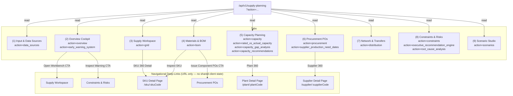

# Supply Planning Module — Architecture Inventory

> **Scope:** Factual audit of the nine tabs exposed via `SupplyChainLayout` navigation.
> **Last audited:** 2026-08-06 | **Stack:** Next.js 14 (App Router), React, Recharts, Lucide icons.
> **API surface:** All data fetched from a single route `/api/v1/supply-planning` using `?action=<action>` query params.

---

## Tab Inventory Table

| # | Tab Name | Route | Purpose (one sentence) | Data Entities Read | Key UI Components / Widgets | Writes / Mutations |
|---|----------|-------|------------------------|-------------------|-----------------------------|--------------------|
| 1 | **Input & Data Sources** | `/supply-planning/data-sources` | Documents the origin, lineage, and business rules for every input feeding the supply planning engine. | `categories[]` (categoryId, categoryName, collectionsUsed, schemaFields, lastSyncTime, healthStatus, recordCount, impactedPlanningOutputs), `planningRulesDetail[]` (ruleId, ruleName, formula) | Ingestion metadata summary list, Planning Input/Output Mapping Matrix table, collapsible Schema Contract `
` per category, Planning Rules & Formulas table | None (read-only) |
| 2 | **Overview Cockpit** | `/supply-planning` | Provides an executive-level health dashboard of supply vs. demand balance with early warnings and quick-launch links. | `overview{}` (serviceLevel, totalDeficitUnits, activeConstraintsCount, totalStockUnits, demandVsSupplyTrend[]), `earlyWarnings[]` (category, probability, triggerDescription, horizonWeek) | 4x `KpiCard` widgets, Predictive Early Warning banner, Recharts `AreaChart` (demand vs. supply trend), 3x Quick-Launch workbench link cards | None (read-only) |
| 3 | **Supply Workspace** | `/supply-planning/workspace` | Renders the 52-week time-phased MRP netting grid for a selected SKU and warehouse location. | `grid[]` (week, forecastQty, availableInventory, plannedProduction, plannedPurchase, projectedInventory, supplyGap, serviceLevel, planningStatus) filtered by `skuCode`, `location`, `startWeek` | SKU / Location / Horizon `<select>` dropdowns, planning horizon zone legend bar, 52-week MRP netting table with `StatusBadge` per row, "Recalculate MRP" button, "SKU 360 Detail" deep-link | `alert()` stub on "Recalculate MRP" |
| 4 | **Materials & BOM** | `/supply-planning/materials` | Explodes the Bill of Materials for a selected parent SKU to expose component quantities, on-hand stock, and gating shortages. | `bom[]` (componentSku, componentName, quantity, unitOfMeasure, scrapPercent, onHandQty, isGating) filtered by `parentSku` | Parent SKU `<select>`, 3x `KpiCard` (component count, gating items, avg scrap %), Multi-Level Component Netting table with SHORTAGE/FEASIBLE `StatusBadge`, "Inspect SKU" deep-link per row | None (read-only) |
| 5 | **Capacity Planning** | `/supply-planning/capacity` | Tracks factory rough-cut capacity utilization, OEE performance, and 52-week capacity gap across all manufacturing plants. | `plantData[]` (plantCode, plantName, city, workingShifts, dailyCapacity, weeklyCapacity, utilizationPercent, status), `ratedVsActual[]` (ratedWeeklyCapacity, plannedProductionLoad, actualRealizedOutput, capacityVarianceUnits, downtimeHours, downtimeReason, overallEquipmentEffectivenessPct), `capacityGap[]` (week, ratedWeeklyCapacity, plannedWorkload, capacityGapUnits, capacityGapHours, utilizationPct, status), `recommendations[]` (recommendationId, plantCode, issue, proposedAction, unitCapacityGain, feasibility) | 3x `KpiCard`, 3-tab sub-navigation (Heatmap / OEE / Gap Analysis), Plant Heatmap table with "Plant 360" deep-link, Rated vs. Actual OEE table, 52-Week Gap table, Recommendations 2-column card grid with "Execute Action" buttons | `alert()` stubs on "Rebalance Line Load" and "Execute Action" |
| 6 | **Procurement POs** | `/supply-planning/procurement` | Manages the purchase order release queue and cross-references supplier delivery dates against factory production need dates. | `pos[]` (poNumber, supplierName, skuCode, orderedQty, receivedQty, expectedDeliveryDate, status, supplierCode), `needDates[]` (poNumber, supplierName, skuCode, expectedDeliveryDate, productionOrderNo, productionNeedDate, dateGapDays, alignmentStatus) | 3x `KpiCard`, 2-tab sub-navigation (PO Queue / Need Dates), PO Release Queue table with "Supplier 360" deep-link, Delivery vs. Need Date Alignment table, "Batch Approve POs" button | `alert()` stub on "Batch Approve POs" |
| 7 | **Network & Transfers** | `/supply-planning/distribution` | Displays stock coverage and inter-DC transfer status across all regional distribution centers. | `networkData[]` (warehouseCode, warehouseName, city, state, warehouseType, capacityUnits, currentStock, daysOfSupply, status) | 3x `KpiCard`, DC Stock Coverage & Flow table with `StatusBadge`, "Create Transfer Order" button | `alert()` stub on "Create Transfer Order" |
| 8 | **Constraints & Risks** | `/supply-planning/constraints` | Surfaces active supply chain exception alerts with AI-generated root-cause trees and executive trade-off recommendations. | `constraints[]` (constraintType, skuCode, constraintSource, severity, description, recommendedAction), `execRecommendations[]` (optionId, title, description, costVarianceInr, serviceLevelImpact, revenueRecoveredInr, recommendationScore, status), `rootCauseTree{}` (causalTreeNodes[], recommendedMitigation) fetched on-demand per selected constraint | 3x `KpiCard`, Executive Recommendation Engine 2-column card grid, Constraint Exception Matrix table, slide-in side drawer with causal tree + AI mitigation narrative, "Mark Resolution Executed" button | `alert()` stubs on "Approve Executive Trade-Off" and "Mark Resolution Executed" |
| 9 | **Scenario Studio** | `/supply-planning/scenarios` | Enables side-by-side S&OP what-if scenario comparison (Baseline vs. Festive Surge vs. Supplier Disruption) before publishing the official plan. | `scenarios[]` (scenario metadata only); the 6-metric comparison matrix is currently hard-coded in JSX | 3x `KpiCard`, Side-by-Side Executive Trade-Off Comparison table (6 metrics x 3 scenario columns), "Build New Scenario" button, "Publish Official S&OP Plan" button | `alert()` stubs on publish and new scenario |

---

## Cross-Tab Data Exchange (Currently Implemented)

The tabs share **no client-side state**. All inter-tab communication is expressed as navigational deep-links (Next.js `<Link>`):

| From Tab | Link Target | Data Carried |
|----------|-------------|--------------|
| Overview Cockpit | Supply Workspace | Static href `/supply-planning/workspace` |
| Overview Cockpit | Constraints & Risks | Static href `/supply-planning/constraints` (from Early Warning banner) |
| Supply Workspace | SKU detail page | Dynamic `skuCode` via URL `/supply-planning/sku/:skuCode` |
| Materials & BOM | Procurement POs | Static href `/supply-planning/procurement` ("Issue Component POs" CTA) |
| Materials & BOM | SKU detail page | Dynamic `componentSku` via URL `/supply-planning/sku/:componentSku` |
| Capacity Planning | Plant detail page | Dynamic `plantCode` via URL `/supply-planning/plant/:plantCode` |
| Procurement POs | Supplier detail page | Dynamic `supplierCode` via URL `/supply-planning/supplier/:supplierCode` |

> **Note:** The SKU (`/sku/:id`), Plant (`/plant/:id`), and Supplier (`/supplier/:id`) detail routes are referenced but not yet scaffolded in the file system as of this audit.

---

## Data-Flow Diagram

---

## Shared Components

| Component | File | Used By |
|-----------|------|---------|
| `SupplyChainLayout` | `components/supply-chain/SupplyChainLayout.jsx` | All 9 tabs (wraps every page, provides nav + header + footer) |
| `KpiCard` | `components/supply-chain/KpiCard.jsx` | Overview Cockpit, Capacity Planning, Materials & BOM, Procurement POs, Network & Transfers, Constraints & Risks, Scenario Studio |
| `StatusBadge` | `components/supply-chain/StatusBadge.jsx` | Supply Workspace, Capacity Planning, Materials & BOM, Procurement POs, Network & Transfers, Constraints & Risks |
