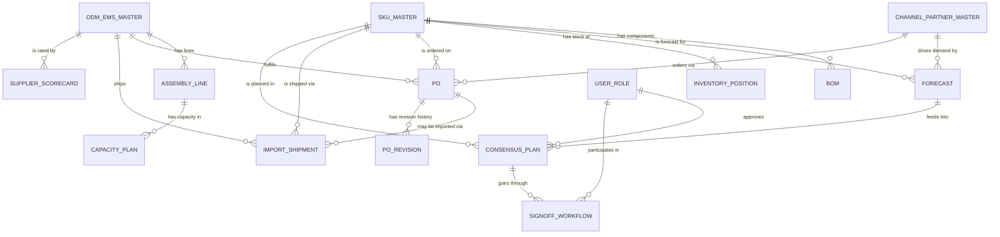

# Supply Planning Suite — Shared Data Model & Navigation Contract

> **Status:** Design contract — no implementation yet.
> **Purpose:** Every future implementation prompt builds against the entities, field lists, and read/write ownership defined here.
> **References:** `docs/ARCHITECTURE.md` (current state) · `docs/GAPS.md` (gap analysis)
> **Notation:** `R` = tab reads this entity (fetches, displays) · `W` = tab writes this entity (creates, updates, deletes, or publishes a state change) · `W*` = write is a state machine transition (status change only, not full CRUD)

---

## 1. Entity Relationship Overview



---

## 2. Core Entities

---

### 2.1 SKU Master

**Purpose:** Single source of truth for every product, component, and raw material in the planning system. All planning entities (Forecast, PO, Inventory, BOM, Consensus Plan) reference this by `skuCode`.

| Field | Type | Description |
|-------|------|-------------|
| `skuCode` | string (PK) | Unique product identifier (e.g. `SKU-BOAT-AD141`) |
| `skuName` | string | Display name (e.g. "boAt Airdopes 141") |
| `skuType` | enum | `FINISHED_GOOD` · `COMPONENT` · `RAW_MATERIAL` · `PACKAGING` |
| `productFamily` | string | Product family grouping (e.g. "TWS", "Smartwatch", "Speaker") |
| `productCategory` | string | Sub-category (e.g. "True Wireless", "Sports Band") |
| `uom` | string | Unit of measure (`Units`, `Pcs`, `Kg`, `Metres`) |
| `standardCost` | number | Standard cost per unit (INR) |
| `sellingPrice` | number | Average selling price per unit (INR) |
| `moq` | number | Minimum order quantity |
| `lotSizeMultiple` | number | Order lot rounding multiple |
| `leadTimeDays` | number | Standard procurement / production lead time in days |
| `safetyStockDays` | number | Configured safety stock coverage target (days) |
| `reorderPoint` | number | Stock level at which replenishment is triggered |
| `isActive` | boolean | Whether the SKU is live in planning |
| `isImported` | boolean | Whether RM/FG is sourced via import |
| `npiFlag` | boolean | True if this SKU is in the NPI pipeline |
| `npiLaunchDate` | date | Target market launch date (NPI only) |
| `defaultOdmCode` | FK → ODM_EMS_MASTER | Primary manufacturing partner |
| `bomVersion` | string | Active BOM version tag |
| `createdAt` | datetime | |
| `updatedAt` | datetime | |

**Read/Write by tab:**

| Tab | Access | Notes |
|-----|--------|-------|
| Input & Data Sources | R | Displays schema provenance for SKU Master |
| Supply Workspace | R | Filters grid by skuCode |
| Materials & BOM | R | Parent and component SKU lookups |
| Capacity Planning | R | SKU-to-plant routing |
| ODM & EMS Master *(new)* | R | Shows which SKUs a vendor produces |
| Procurement POs | R | SKU on each PO line |
| Import Tracking *(new)* | R | SKU on import PO |
| Inventory Planning *(new)* | R, W | Safety stock norms, reorder point edits |
| Constraints & Risks | R | SKU-level exception matching |
| Scenario Studio | R | Scenario comparisons reference SKUs |
| **Input & Data Sources** | **W** | Master CRUD for SKU fields (only authorised admin/NPI Manager role) |

---

### 2.2 Channel / Partner Master

**Purpose:** Defines every sales channel, distribution partner, and customer segment that generates demand. Enables the Forecast entity to be split by channel so the Demand vs. Supply view can be drilled from total to channel level.

| Field | Type | Description |
|-------|------|-------------|
| `channelCode` | string (PK) | e.g. `CH-AMZ-IN`, `CH-FLIP-IN`, `CH-GT-SOUTH` |
| `channelName` | string | Display name ("Amazon India", "Flipkart", "General Trade South") |
| `channelType` | enum | `E-COMMERCE` · `MODERN_TRADE` · `GENERAL_TRADE` · `EXPORT` · `B2B` |
| `partnerName` | string | Legal entity name of the partner |
| `region` | string | Geographic region (North / South / East / West / Pan-India / Export) |
| `state` | string | State if region-specific |
| `accountManagerId` | FK → USER | Internal owner |
| `creditTermsDays` | number | Payment terms in days |
| `forecastSubmissionLeadDays` | number | How many days in advance channel submits demand |
| `isActive` | boolean | |

**Read/Write by tab:**

| Tab | Access | Notes |
|-----|--------|-------|
| Input & Data Sources | R | Displays channel master as a data source category |
| Demand Planning *(new)* | R, W | Primary home — channel forecasts are entered here |
| Overview Cockpit | R | Demand vs. supply chart split by channel |
| Supply Workspace | R | Filter grid by channel |
| Inventory Planning *(new)* | R | Channel-wise stock allocation |
| Scenario Studio | R | Channel demand levers in what-if |

---

### 2.3 ODM / EMS Master

**Purpose:** Vendor master for all manufacturing partners (ODM = Original Design Manufacturer, EMS = Electronics Manufacturing Services). Closes GAPS.md Req 2 and Req 10. This becomes the destination for the "Supplier 360°" and "Plant 360°" deep-links that currently point to unscaffolded routes.

#### 2.3a ODM_EMS_MASTER (vendor-level)

| Field | Type | Description |
|-------|------|-------------|
| `vendorCode` | string (PK) | e.g. `ODM-FOXLINK-IN`, `EMS-SALCOMP-IN` |
| `vendorName` | string | Legal entity name |
| `vendorType` | enum | `ODM` · `EMS` · `CM` (Contract Manufacturer) |
| `tier` | enum | `TIER_1` · `TIER_2` · `TIER_3` |
| `country` | string | Country of operation |
| `city` | string | City |
| `primaryContactName` | string | |
| `primaryContactEmail` | string | |
| `contractStartDate` | date | Current contract validity start |
| `contractEndDate` | date | Current contract expiry |
| `paymentTermsDays` | number | |
| `currencyCode` | string | e.g. `INR`, `USD`, `CNY` |
| `qualityCertifications` | string[] | e.g. `["ISO 9001", "IATF 16949"]` |
| `isActive` | boolean | |

#### 2.3b ASSEMBLY_LINE (line-level, child of ODM_EMS_MASTER)

| Field | Type | Description |
|-------|------|-------------|
| `lineId` | string (PK) | e.g. `LINE-FOXLINK-L2` |
| `vendorCode` | FK → ODM_EMS_MASTER | Parent vendor |
| `lineName` | string | e.g. "Line 2 — TWS Assembly" |
| `productFamily` | string | Product families this line is configured for |
| `ratedDailyCapacity` | number | Design-rated units/day |
| `ratedWeeklyCapacity` | number | Design-rated units/week |
| `contractedWeeklyCapacity` | number | Capacity booked under contract |
| `workingDays` | number | Working days per week |
| `workingShifts` | number | Shifts per day |
| `quotedLeadTimeDays` | number | Vendor-quoted manufacturing lead time |
| `actualAvgLeadTimeDays` | number | Rolling 13-week average actual lead time |
| `npiReservedCapacity` | number | Units/week earmarked for NPI ramp |
| `seasonalBlockWeeks` | string[] | Weeks blocked for shutdown / maintenance |
| `lineStatus` | enum | `ACTIVE` · `SHUTDOWN` · `RAMP_UP` · `DECOMMISSIONED` |

**Read/Write by tab:**

| Tab | Access | Notes |
|-----|--------|-------|
| Input & Data Sources | R | Provenance metadata for ODM/EMS master feeds |
| ODM & EMS Master *(new)* | R, W | Primary home — CRUD for both tables |
| Capacity Planning | R | Reads ratedWeeklyCapacity, contractedWeeklyCapacity, lineStatus for heatmap |
| Procurement POs | R | Reads vendorCode, quotedLeadTimeDays to validate PO dates |
| Constraints & Risks | R | Reads lineStatus, actualAvgLeadTimeDays for exception detection |
| Scenario Studio | R | Capacity expansion levers reference contractedWeeklyCapacity |
| Supply Workspace | R | Reads contractedWeeklyCapacity as the cap for plannedProduction |

---

### 2.4 Forecast

**Purpose:** Stores demand signal at the SKU × Channel × Week × Horizon granularity. This single entity powers the Demand vs. Supply view, the MRP netting grid in Supply Workspace, and all scenario comparisons. Three horizon types have different data owners, refresh cadences, and lock rules.

| Field | Type | Description |
|-------|------|-------------|
| `forecastId` | string (PK) | UUID |
| `skuCode` | FK → SKU_MASTER | |
| `channelCode` | FK → CHANNEL_PARTNER_MASTER | Null for total/aggregated rows |
| `planningWeek` | string | ISO week key e.g. `2026-W34` |
| `horizonType` | enum | `SHORT` (W+0 to W+4) · `MID` (W+5 to W+26) · `LONG` (W+27 to W+52+) |
| `forecastType` | enum | `STATISTICAL` · `CHANNEL_SUBMITTED` · `CONSENSUS` · `ACTUALS` |
| `forecastQty` | number | Units |
| `forecastValue` | number | INR revenue equivalent |
| `confidenceLevel` | enum | `HIGH` · `MEDIUM` · `LOW` |
| `isFrozen` | boolean | True for SHORT horizon weeks once consensus is locked |
| `frozenAt` | datetime | Timestamp when this week's row was locked |
| `frozenByUserId` | FK → USER | Who locked it |
| `sourceSystem` | string | e.g. "Demand Planning Module", "Channel EDI", "Manual" |
| `version` | number | Monotonically incrementing version per skuCode × channelCode × week |
| `createdAt` | datetime | |
| `updatedAt` | datetime | |

**Read/Write by tab:**

| Tab | Access | Notes |
|-----|--------|-------|
| Input & Data Sources | R | Forecast as a source category — shows record count, health, last sync |
| Demand Planning *(new)* | R, W | Primary home — enters CHANNEL_SUBMITTED and CONSENSUS forecasts |
| Overview Cockpit | R | Aggregated demand totals for the trend chart |
| Supply Workspace | R | forecastQty drives the grossDemand column of the MRP grid |
| Inventory Planning *(new)* | R | Forecast drives safety stock calculations |
| Scenario Studio | R, W | Reads CONSENSUS forecast as baseline; writes STATISTICAL variants for what-if scenarios |
| Constraints & Risks | R | Supply gap = forecastQty − totalSupply triggers exception alerts |

---

### 2.5 Purchase Order (PO)

**Purpose:** Tracks every purchase order — domestic and import — from release through receipt. Replaces the current read-only `pos[]` stub with a writable entity that carries Handover Dates, exclusion flags, and a revision log. This single entity unifies the current Procurement POs tab and feeds Import Tracking for import-classified POs.

| Field | Type | Description |
|-------|------|-------------|
| `poNumber` | string (PK) | e.g. `PO-2026-08341` |
| `poType` | enum | `DOMESTIC` · `IMPORT_RM` · `IMPORT_FG` |
| `skuCode` | FK → SKU_MASTER | |
| `vendorCode` | FK → ODM_EMS_MASTER | |
| `channelCode` | FK → CHANNEL_PARTNER_MASTER | Nullable — for channel-specific fulfilment POs |
| `orderedQty` | number | Original ordered quantity |
| `confirmedQty` | number | Vendor-confirmed quantity |
| `receivedQty` | number | Quantity goods-receipted to warehouse |
| `openQty` | number | Computed: confirmedQty − receivedQty |
| `expectedDeliveryDate` | date | Vendor-promised delivery date |
| `handoverDate` | date | **Contractual Handover Date (HOD)** — distinct from expectedDeliveryDate |
| `actualDeliveryDate` | date | Date goods were physically received |
| `hodAdherenceDays` | number | Computed: actualDeliveryDate − handoverDate (negative = early, positive = late) |
| `planningWeek` | string | Week of expected delivery (for MRP netting) |
| `unitCost` | number | Cost per unit (INR) |
| `totalPoValue` | number | orderedQty × unitCost |
| `status` | enum | `DRAFT` · `PENDING_APPROVAL` · `APPROVED` · `IN_TRANSIT` · `PARTIALLY_RECEIVED` · `FULLY_RECEIVED` · `CLOSED` · `CANCELLED` |
| `exclusionFlag` | enum | `NONE` · `HOLD` · `FORCE_CLOSE` · `PARTIAL_ACCEPT` |
| `exclusionReason` | string | Free text reason for exclusion |
| `approvedByUserId` | FK → USER | |
| `approvedAt` | datetime | |
| `linkedProductionOrder` | string | Production work order this PO feeds |
| `createdByUserId` | FK → USER | |
| `createdAt` | datetime | |
| `updatedAt` | datetime | |

#### 2.5a PO_REVISION (audit child of PO)

| Field | Type | Description |
|-------|------|-------------|
| `revisionId` | string (PK) | UUID |
| `poNumber` | FK → PO | |
| `revisedByUserId` | FK → USER | |
| `revisedAt` | datetime | |
| `fieldChanged` | string | Field name that changed |
| `oldValue` | string | |
| `newValue` | string | |
| `changeReason` | string | |

**Read/Write by tab:**

| Tab | Access | Notes |
|-----|--------|-------|
| Input & Data Sources | R | PO collection as a data source category |
| Supply Workspace | R | plannedPurchase column reads open POs by planningWeek |
| Materials & BOM | R | Surfaces component PO availability for gating check |
| ODM & EMS Master *(new)* | R | POs listed on vendor scorecard for OTD calculation |
| Procurement POs | R, W | Primary home — create, approve, exclude, amend POs; revision log view |
| Import Tracking *(new)* | R, W | Filters poType = IMPORT_RM or IMPORT_FG; updates customs/vessel fields |
| Constraints & Risks | R | Late POs (hodAdherenceDays > 0) surface as exceptions |
| Overview Cockpit | R | PO adherence KPI reads hodAdherenceDays aggregated across open POs |

---

### 2.6 Import Shipment

**Purpose:** Net-new entity (not present at all today). Tracks each import consignment from PO release through port arrival and customs clearance. Linked 1:many from PO (one PO can span multiple shipments; one shipment can consolidate multiple PO lines).

| Field | Type | Description |
|-------|------|-------------|
| `shipmentId` | string (PK) | e.g. `SHP-2026-04712` |
| `shipmentType` | enum | `SEA` · `AIR` · `COURIER` |
| `poNumbers` | FK[] → PO | One or more PO lines consolidated in this shipment |
| `vendorCode` | FK → ODM_EMS_MASTER | |
| `portOfOrigin` | string | e.g. "Shenzhen", "Shanghai" |
| `portOfDestination` | string | e.g. "JNPT Mumbai", "Chennai Sea Port" |
| `billOfLadingNo` | string | BoL or AWB number |
| `vesselOrFlightName` | string | |
| `etdDate` | date | Estimated Time of Departure |
| `etaDate` | date | Estimated Time of Arrival at port |
| `atdDate` | date | Actual Time of Departure |
| `ataDate` | date | Actual Time of Arrival at port |
| `customsClearanceStatus` | enum | `PENDING` · `UNDER_EXAM` · `CLEARED` · `HOLD` · `DEMURRAGE` |
| `customsClearanceDate` | date | Date customs cleared |
| `dutyAmount` | number | Total customs duty paid (INR) |
| `freightCost` | number | Freight cost (INR) |
| `demurrageCost` | number | Demurrage cost if held at port |
| `warehouseArrivalDate` | date | Date stock physically received in warehouse |
| `totalQty` | number | Total units in this shipment |
| `skuBreakdown` | object[] | Array of { skuCode, qty } per SKU in shipment |
| `status` | enum | `BOOKED` · `IN_TRANSIT` · `AT_PORT` · `CLEARED` · `DELIVERED` |
| `inTransitInventory` | number | Quantity currently in transit (totalQty − receivedQty) |
| `createdByUserId` | FK → USER | |
| `createdAt` | datetime | |
| `updatedAt` | datetime | |

**Read/Write by tab:**

| Tab | Access | Notes |
|-----|--------|-------|
| Input & Data Sources | R | Import Shipment as a source category |
| Import Tracking *(new)* | R, W | Primary home — full CRUD + status updates |
| Inventory Planning *(new)* | R | inTransitInventory included in projected stock position |
| Supply Workspace | R | inTransitInventory can be an optional column in the MRP grid |
| Procurement POs | R | View import shipment status linked to a PO |
| Network & Transfers | R | Arrival at port feeds warehouse inbound pipeline |
| Overview Cockpit | R | Import In-Transit Count KPI |
| Constraints & Risks | R | Shipments with HOLD or DEMURRAGE status trigger exceptions |

---

### 2.7 Inventory Position

**Purpose:** The live stock snapshot for each SKU at each stocking location. This entity is what makes the "Continuous Demand vs. Supply View" possible: Supply = Inventory Position + open POs + planned production. Without a consistent inventory entity shared across tabs, each tab currently works from disconnected snapshots.

| Field | Type | Description |
|-------|------|-------------|
| `inventoryId` | string (PK) | UUID |
| `skuCode` | FK → SKU_MASTER | |
| `locationCode` | string | Warehouse / DC code (e.g. `WH-NORTH-DELHI`) |
| `locationType` | enum | `WAREHOUSE` · `PLANT` · `IN_TRANSIT` · `CHANNEL_STOCK` |
| `snapshotWeek` | string | ISO week of this inventory snapshot |
| `openingStock` | number | Stock at start of week |
| `closingStock` | number | Stock at end of week (computed) |
| `availableToPromise` | number | openingStock + inboundPOs − outboundOrders |
| `onHandQty` | number | Physically counted on-hand stock |
| `inTransitQty` | number | In-transit from imports or inter-DC transfers |
| `reservedQty` | number | Allocated to confirmed orders |
| `daysOfSupply` | number | closingStock ÷ average daily demand |
| `safetyStockQty` | number | Configured safety buffer quantity |
| `stockStatus` | enum | `HEALTHY` · `LOW` · `CRITICAL` · `OVERSTOCK` |
| `lastUpdatedAt` | datetime | Timestamp of last WMS/ERP sync |
| `sourceSystem` | string | WMS system name |

**Read/Write by tab:**

| Tab | Access | Notes |
|-----|--------|-------|
| Input & Data Sources | R | Inventory as a source category — shows sync health |
| Supply Workspace | R | availableToPromise → availableInventory column in MRP grid |
| Materials & BOM | R | onHandQty per component for gating check |
| Inventory Planning *(new)* | R, W | Primary home — view all locations, edit safety stock norms, trigger reorder |
| Network & Transfers | R, W | Reads closingStock per DC; W creates inter-DC transfer orders that update reservedQty |
| Overview Cockpit | R | Warehouse Stock Available KPI; Demand vs. Supply chart supply line |
| Constraints & Risks | R | stockStatus = CRITICAL triggers supply gap exception |
| Scenario Studio | R | Opening inventory position feeds baseline scenario |

---

### 2.8 Consensus Plan

**Purpose:** The official, approved supply plan for a given SKU × Week, produced after the S&OP signoff workflow. This is the entity that "publishes" the outcome of Scenario Studio and locks it for downstream execution. Currently this entity does not exist — the "Publish" button in Scenario Studio fires an `alert()` stub.

| Field | Type | Description |
|-------|------|-------------|
| `planId` | string (PK) | UUID |
| `skuCode` | FK → SKU_MASTER | |
| `planningWeek` | string | ISO week |
| `planVersion` | number | Monotonic version number |
| `consensusDemand` | number | Agreed demand quantity for the week |
| `plannedProduction` | number | Agreed factory production target |
| `plannedPurchase` | number | Agreed PO quantity for the week |
| `projectedInventory` | number | Computed projected closing stock |
| `supplyGap` | number | consensusDemand − (plannedProduction + plannedPurchase + openingStock) |
| `serviceLevel` | number | Projected service level % |
| `planStatus` | enum | `DRAFT` · `UNDER_REVIEW` · `APPROVED` · `LOCKED` · `SUPERSEDED` |
| `scenarioId` | string | Source scenario that generated this plan |
| `lockedWeeks` | string[] | Weeks within this plan that are frozen for execution |
| `createdByUserId` | FK → USER | |
| `createdAt` | datetime | |

#### 2.8a SIGNOFF_WORKFLOW (child of Consensus Plan)

| Field | Type | Description |
|-------|------|-------------|
| `workflowId` | string (PK) | UUID |
| `planId` | FK → CONSENSUS_PLAN | |
| `stepOrder` | number | 1, 2, 3… |
| `stepName` | string | e.g. "Demand Review", "Supply Review", "Finance Gate", "S&OP Lead Approval" |
| `requiredRole` | enum | `PRODUCTION_PLANNER` · `SOURCING` · `SOP_LEAD` · `FINANCE` · `NPI_MANAGER` |
| `assignedUserId` | FK → USER | |
| `status` | enum | `PENDING` · `APPROVED` · `REJECTED` · `ESCALATED` |
| `approvedAt` | datetime | |
| `comments` | string | Free text comments from approver |

**Read/Write by tab:**

| Tab | Access | Notes |
|-----|--------|-------|
| Scenario Studio | R, W | Primary home — creates DRAFT plan, runs signoff workflow, publishes LOCKED plan |
| Supply Workspace | R | Reads LOCKED/APPROVED plan to show locked weeks (firm zone) |
| Overview Cockpit | R | serviceLevel KPI and Demand vs. Supply chart pulled from latest LOCKED plan |
| Constraints & Risks | R | supplyGap on the LOCKED plan surfaces as exceptions |
| Demand Planning *(new)* | R | Consensus demand from LOCKED plan is the frozen demand signal |
| Capacity Planning | R | plannedProduction drives capacity workload calculation |
| Procurement POs | R | plannedPurchase drives PO requirements by week |
| Inventory Planning *(new)* | R | projectedInventory feeds stock health monitoring |

---

### 2.9 Supplier Scorecard

**Purpose:** Aggregated performance view per ODM/EMS vendor, computed from PO and Import Shipment history. Currently entirely absent. Powers Req 10.

| Field | Type | Description |
|-------|------|-------------|
| `scorecardId` | string (PK) | UUID |
| `vendorCode` | FK → ODM_EMS_MASTER | |
| `evaluationPeriod` | enum | `ROLLING_4W` · `ROLLING_13W` · `ROLLING_52W` |
| `snapshotDate` | date | Date this scorecard was computed |
| `otdPercent` | number | On-time delivery % (deliveries with hodAdherenceDays ≤ 0) |
| `avgLeadTimeDays` | number | Average actual lead time across closed POs |
| `quotedLeadTimeDays` | number | Vendor-quoted lead time (from ASSEMBLY_LINE) |
| `leadTimeVarianceDays` | number | avgLeadTimeDays − quotedLeadTimeDays |
| `qualityRejectionRate` | number | % of received units rejected at incoming QC |
| `totalPosEvaluated` | number | Count of POs in evaluation window |
| `reliabilityScore` | number | Composite score 0–100 (formula: configurable weighted average of OTD, lead-time variance, quality) |
| `reliabilityGrade` | enum | `A` · `B` · `C` · `D` |
| `trend` | enum | `IMPROVING` · `STABLE` · `DECLINING` |

**Read/Write by tab:**

| Tab | Access | Notes |
|-----|--------|-------|
| ODM & EMS Master *(new)* | R, W | Primary home — displays scorecard, allows manual quality rejection input |
| Overview Cockpit | R | Supplier OTD % KPI reads from otdPercent |
| Procurement POs | R | Shows vendor reliability grade inline on PO rows |
| Constraints & Risks | R | Vendors with reliabilityGrade = C or D trigger exception alerts |
| Scenario Studio | R | Supplier disruption scenario can use reliabilityScore as input lever |

---

## 3. Finalized Top Navigation Structure

### Design Principles Applied

1. **Workflow ownership first:** Each top-level tab has one primary user role who owns it. Tabs that merge two roles' workflows create context switching and permission complexity.
2. **Tier-1 gaps get dedicated space:** Req 3, 4, 10 are fully absent and have enough surface area / distinct data domains to warrant their own tabs.
3. **GAPS.md IA is adopted with one revision:** GAPS.md proposed ODM & EMS Master as a standalone tab (correct) and Access & Roles as a separate tab (adopted as a lightweight Settings tab). The new insight here is that a **Demand Planning** tab and an **Inventory Planning** tab are required to make the Forecast and Inventory Position entities writable — without them, the Continuous Demand vs. Supply view (Req 7) and safety stock management remain read-only and broken.

### Navigation Map

```
┌─────────────────────────────────────────────────────────┐
│  GROUP: Data Foundation                                  │
│  ─────────────────────────────────────────────────────  │
│  1. Input & Data Sources   (existing — extend with CRUD) │
└─────────────────────────────────────────────────────────┘
┌─────────────────────────────────────────────────────────┐
│  GROUP: Demand & Consensus                               │
│  ─────────────────────────────────────────────────────  │
│  2. Demand Planning        [NEW TAB]                     │
│  3. Overview Cockpit       (existing — extend KPIs)      │
│  4. Scenario Studio        (existing — add signoff)      │
└─────────────────────────────────────────────────────────┘
┌─────────────────────────────────────────────────────────┐
│  GROUP: Supply Execution                                 │
│  ─────────────────────────────────────────────────────  │
│  5. Supply Workspace       (existing — add constraints)  │
│  6. Materials & BOM        (existing)                    │
│  7. Capacity Planning      (existing — add line detail)  │
│  8. ODM & EMS Master       [NEW TAB]                     │
└─────────────────────────────────────────────────────────┘
┌─────────────────────────────────────────────────────────┐
│  GROUP: Procurement & Logistics                          │
│  ─────────────────────────────────────────────────────  │
│  9.  Procurement POs       (existing — add HOD + writes) │
│  10. Import Tracking       [NEW TAB]                     │
│  11. Network & Transfers   (existing)                    │
└─────────────────────────────────────────────────────────┘
┌─────────────────────────────────────────────────────────┐
│  GROUP: Inventory & Risk                                 │
│  ─────────────────────────────────────────────────────  │
│  12. Inventory Planning    [NEW TAB]                     │
│  13. Constraints & Risks   (existing)                    │
└─────────────────────────────────────────────────────────┘
┌─────────────────────────────────────────────────────────┐
│  System                                                  │
│  ─────────────────────────────────────────────────────  │
│  14. Settings / Roles      [NEW — app-shell + admin tab] │
└─────────────────────────────────────────────────────────┘
```

### New Tab Justifications

| New Tab | Route | Addresses Req # | Why top-level (not embedded) |
|---------|-------|-----------------|------------------------------|
| **Demand Planning** | `/supply-planning/demand-planning` | 7 | The Forecast entity needs a writable home — channel-submitted and consensus forecasts cannot be entered in Supply Workspace (an MRP view) or Overview Cockpit (a read-only dashboard). This tab is owned by the S&OP / Demand Planner role. |
| **ODM & EMS Master** | `/supply-planning/odm-ems` | 2, 10 | Vendor master CRUD + reliability scorecards are owned by Sourcing, not Production Planning. Embedding in Capacity Planning would mix two separate teams' workflows and data write permissions. This tab resolves the currently unscaffolded "Supplier 360°" and "Plant 360°" deep-links. |
| **Import Tracking** | `/supply-planning/import` | 4 | Import POs have a completely different data shape (BoL, vessel, customs, port) and a different responsible team (Import / Logistics). The planning cadence is shipment-window based, not weekly MRP. Embedding in Procurement POs would overload an already complex tab. |
| **Inventory Planning** | `/supply-planning/inventory` | 5 (partial), 7 | Safety stock norms, reorder point management, and in-transit visibility require a dedicated write surface. Without this, the Supply Workspace MRP grid will always work from a stale static snapshot rather than a managed inventory position. |
| **Settings / Roles** | `/supply-planning/settings` | 3 | Role-based access is a cross-cutting concern. Authentication lives at Next.js middleware level; the Settings tab provides role assignment UI and audit trail for an admin. |

### Sub-sections Added to Existing Tabs

| Existing Tab | New Sub-tabs / Sections | Addresses |
|---|---|---|
| **Procurement POs** | + "HOD Adherence" sub-tab (Handover Date tracking, adherence %, exclusion flags, revision log) + live write path for approve/amend | Req 1 |
| **Capacity Planning** | + "Assembly Lines" sub-tab (line-level rows with contractedWeeklyCapacity, NPI reserved, seasonal blocks) + medium/long horizon segment labels + CapEx roadmap section | Req 2, 9 |
| **Overview Cockpit** | + KPI registry (configurable thresholds, sparklines) + additional KPIs: PO Adherence %, Supplier OTD %, Import In-Transit Count, NPI Readiness % + horizon toggle (Short / Mid) on Demand vs. Supply chart + demand signal source selector | Req 7, 8 |
| **Supply Workspace** | + "Constrained Plan" column = min(contractedCapacity, availableRM, grossDemand) per week + RM availability badge per row (live from Inventory Position) | Req 5 |
| **Scenario Studio** | + Signoff Workflow panel (DRAFT → UNDER_REVIEW → APPROVED → LOCKED state machine with named approvers) + plan lock indicator + capacity lever inputs linked to Capacity Planning | Req 6, 9 |

---

## 4. Entity × Tab Read/Write Matrix (complete)

> R = Read · W = Write · — = no access

| Entity | Input & Data | Demand Planning | Overview Cockpit | Scenario Studio | Supply Workspace | Materials & BOM | Capacity Planning | ODM & EMS Master | Procurement POs | Import Tracking | Network & Transfers | Inventory Planning | Constraints & Risks | Settings |
|--------|-------------|-----------------|-----------------|-----------------|-----------------|-----------------|-------------------|-----------------|----------------|----------------|--------------------|--------------------|--------------------|----|
| SKU Master | R,**W** | R | R | R | R | R | R | R | R | R | R | R,**W** | R | — |
| Channel / Partner Master | R | R,**W** | R | R | — | — | — | — | R | — | — | R | — | — |
| ODM / EMS Master | R | — | — | R | R | — | R | R,**W** | R | R | — | — | R | — |
| Assembly Line | R | — | — | R | R | — | R | R,**W** | — | — | — | — | R | — |
| Forecast | R | R,**W** | R | R,**W** | R | — | — | — | — | — | — | R | R | — |
| Purchase Order | R | — | R | — | R | R | — | R | R,**W** | R,**W** | — | — | R | — |
| PO Revision | — | — | — | — | — | — | — | — | R,**W** | R | — | — | — | — |
| Import Shipment | R | — | R | — | R | — | — | R | R | R,**W** | R | R | R | — |
| Inventory Position | R | — | R | R | R | R | — | — | — | — | R,**W** | R,**W** | R | — |
| Consensus Plan | — | R | R | R,**W** | R | — | R | — | R | — | — | R | R | — |
| Signoff Workflow | — | — | — | R,**W** | — | — | — | — | — | — | — | — | — | — |
| Supplier Scorecard | — | — | R | R | — | — | — | R,**W** | R | — | — | — | R | — |
| User / Role | — | — | — | — | — | — | — | — | — | — | — | — | — | R,**W** |

---

## 5. API Action Naming Convention

All entities are served via the existing `/api/v1/supply-planning?action=<action>` pattern. New actions to add:

| Entity | Actions |
|--------|---------|
| SKU Master | `sku_list` · `sku_detail` · `sku_create` · `sku_update` |
| Channel / Partner | `channel_list` · `channel_create` · `channel_update` |
| ODM / EMS Master | `odm_list` · `odm_detail` · `odm_create` · `odm_update` · `assembly_line_list` · `assembly_line_update` |
| Forecast | `forecast_list` · `forecast_submit` · `forecast_freeze` · `forecast_versions` |
| Purchase Order | `po_list` · `po_create` · `po_update` · `po_approve` · `po_exclude` · `po_revisions` |
| Import Shipment | `import_list` · `import_create` · `import_update_status` · `import_customs_update` |
| Inventory Position | `inventory_list` · `inventory_snapshot` · `inventory_safety_stock_update` |
| Consensus Plan | `plan_list` · `plan_create` · `plan_publish` · `plan_lock_week` · `signoff_submit` |
| Supplier Scorecard | `scorecard_list` · `scorecard_compute` |
