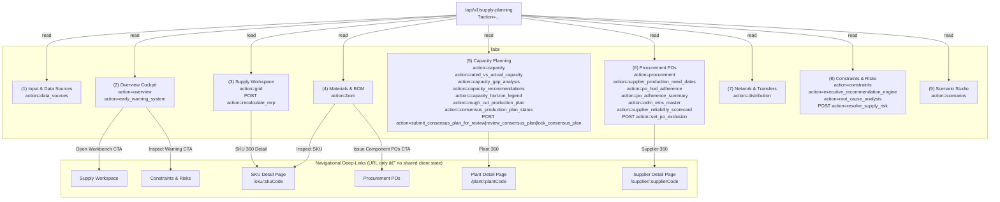
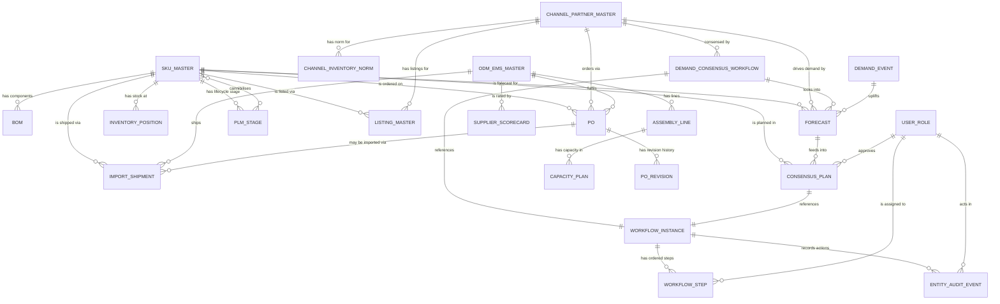

# Supply Planning Module — Complete Documentation

> **Scope:** This file is the single source of truth for the Supply Planning module.
> It consolidates three documents: Architecture Inventory, Gap Analysis, and Shared Data Model.
> **Last consolidated:** 2026-08-13
> **References:** docs/modules/demand-planning.md (Demand Planning extension)

---
# Supply Planning Module — Architecture Inventory

> **Scope:** Factual audit of the nine tabs exposed via `SupplyChainLayout` navigation.
> **Last audited:** 2026-08-06 | **Stack:** Next.js 14 (App Router), React, Recharts, Lucide icons.
> **API surface:** All data fetched from a single route `/api/v1/supply-planning` using `?action=<action>` query params.

---

## Tab Inventory Table

| # | Tab Name | Route | Purpose (one sentence) | Data Entities Read | Key UI Components / Widgets | Writes / Mutations |
|---|----------|-------|------------------------|-------------------|-----------------------------|--------------------|
| 1 | **Input & Data Sources** | `/supply-planning/data-sources` | Documents the origin, lineage, and business rules for every input feeding the supply planning engine. | `categories[]` (categoryId, categoryName, collectionsUsed, schemaFields, lastSyncTime, healthStatus, recordCount, impactedPlanningOutputs), `planningRulesDetail[]` (ruleId, ruleName, formula) | Ingestion metadata summary list, Planning Input/Output Mapping Matrix table, collapsible Schema Contract `<details>` per category, Planning Rules & Formulas table | None (read-only) |
| 2 | **Overview Cockpit** | `/supply-planning` | Provides an executive-level health dashboard of supply vs. demand balance with early warnings and quick-launch links. | `overview{}` (serviceLevel, totalDeficitUnits, activeConstraintsCount, totalStockUnits, demandVsSupplyTrend[]), `earlyWarnings[]` (category, probability, triggerDescription, horizonWeek) | 4x `KpiCard` widgets, Predictive Early Warning banner, Recharts `AreaChart` (demand vs. supply trend), 3x Quick-Launch workbench link cards | None (read-only) |
| 3 | **Supply Workspace** | `/supply-planning/workspace` | Renders the 52-week time-phased MRP netting grid and recalculates a constrained supply plan for a selected SKU and warehouse location. | Canonical event-adjusted `grid[]` demand plus `product_master`, `bom_master`, `inventory`, open `purchase_orders`, `manufacturing_partner_lines`, and `line_capacity_plans`; calculated rows add openingInventoryQty, openPoReceiptQty, netRequirementQty, remainingCapacityQty, rmBuildableQty, componentRequirements, netMaterialRequirementQty, plannedProduction, projectedInventory, supplyGap, serviceLevel, and constraintReasons | SKU / Location / Horizon `<select>` dropdowns, planning horizon zone legend bar, recalculated MRP netting table with RM/capacity constraints and `StatusBadge`, "Recalculate MRP" button, "SKU 360 Detail" deep-link | `POST action=recalculate_mrp` persists an active `mrp_calculation_runs` header and its `mrp_calculation_lines`; subsequent grid reads reload that run without modifying canonical input facts |
| 4 | **Materials & BOM** | `/supply-planning/materials` | Explodes the Bill of Materials for a selected parent SKU to expose component quantities, on-hand stock, and gating shortages. | `bom[]` (componentSku, componentName, quantity, unitOfMeasure, scrapPercent, onHandQty, isGating) filtered by `parentSku` | Parent SKU `<select>`, 3x `KpiCard` (component count, gating items, avg scrap %), Multi-Level Component Netting table with SHORTAGE/FEASIBLE `StatusBadge`, "Inspect SKU" deep-link per row | None (read-only) |
| 5 | **Capacity Planning** | `/supply-planning/capacity` | Tracks factory rough-cut capacity utilization, OEE performance, and a horizon-segmented (Short/Medium/Long) 52-week capacity gap across all manufacturing plants; derives an RM- and capacity-constrained Rough-Cut Production Plan; and runs the Consensus Production Planning signoff workflow. | `plantData[]` (plantCode, plantName, city, workingShifts, dailyCapacity, weeklyCapacity, utilizationPercent, status), `ratedVsActual[]` (ratedWeeklyCapacity, plannedProductionLoad, actualRealizedOutput, capacityVarianceUnits, downtimeHours, downtimeReason, overallEquipmentEffectivenessPct), `capacityGap[]` (week, **horizonTier** [SHORT/MEDIUM/LONG], ratedWeeklyCapacity, plannedWorkload, capacityGapUnits, capacityGapHours, utilizationPct, **plannedCapacityChangeUnits** [CapEx/new-line event], status) — now a full 52-week rolling array instead of a fixed 8-week window, `horizonLegend{}` (shortTerm/mediumTerm/longTerm {label, range, description}), `roughCutPlan{}` (parentSku, gatingComponent, rmMaxBuildableQty, asOf, rows[] {week, horizonTier, demandQty, rmMaxBuildableQty, capacityConstraintUnits, constrainedProductionQty, shortfallUnits, constraintBinding, feasible}), `consensusPlanStatus{}` (planId, planningCycle, status [DRAFT/IN_REVIEW/APPROVED/LOCKED], submittedBy/At, reviewedBy/At, approvedBy/At, lockedBy/At, history[]), `recommendations[]` (recommendationId, plantCode, issue, proposedAction, unitCapacityGain, feasibility) | 3x `KpiCard`, 4-tab sub-navigation (Heatmap / OEE / Gap Analysis / Rough-Cut & Consensus Signoff), Plant Heatmap table with "Plant 360" deep-link, Rated vs. Actual OEE table, 52-Week Gap table with horizon-tier legend + tier badges + CapEx event column, Rough-Cut Production Plan table (RM-buildable vs. capacity-constrained vs. demand, binding-constraint flag), Consensus Signoff panel (status badge, stamped history log, action buttons gated by state), Recommendations 2-column card grid with "Execute Action" buttons | `alert()` stubs on "Rebalance Line Load" and "Execute Action"; **real write path** — signoff buttons call `POST action=submit_consensus_plan_for_review` / `review_consensus_plan` / `lock_consensus_plan`, persisted in-memory (`consensusProductionPlanState` in `supplyChainService.js`) as a DRAFT → IN_REVIEW → APPROVED → LOCKED state machine with a full transition history log |
| 6 | **Procurement POs** | `/supply-planning/procurement` | Manages the purchase order release queue, cross-references supplier delivery dates against factory production need dates, tracks PO adherence against contractual Handover Dates (HOD), and hosts the ODM/EMS vendor master with a supplier reliability scorecard. | `pos[]` (poNumber, supplierName, skuCode, orderedQty, receivedQty, expectedDeliveryDate, status, supplierCode), `needDates[]` (poNumber, supplierName, skuCode, expectedDeliveryDate, productionOrderNo, productionNeedDate, dateGapDays, alignmentStatus), `hodAdherence[]` (poNumber, supplierName, skuCode, handoverDate, expectedDeliveryDate, actualDeliveryDate, hodVarianceDays, adherenceStatus, exclusion{exclusionCode, reason, flaggedBy, flaggedAt}, revisionHistory[]), `adherenceSummary{}` (rollingWindow, totalTrackedPOs, excludedFromDenominator, onTimeHandoverPct, atRiskOrLateCount, targetAdherencePct, trend[]), `odmEmsMaster[]` (supplierCode, supplierName, vendorType, tierClassification, contractedLeadTimeDays, totalProductionCapacityUnitsPerWeek, contractedCapacityUnitsPerWeek, spotCapacityUnitsPerWeek, npiRampCapacityUnitsPerWeek, lines[] {lineId, skuCode, lineCapacityUnitsPerWeek, leadTimeDays, moq, orderMultiple, preferredSupplier}), `reliabilityScorecard[]` (supplierCode, onTimeDelivery4/13/52Week, quotedLeadTimeDays, actualAvgLeadTimeDays, leadTimeVarianceDays/Pct, qualityScore, rejectionRatePct, reliabilityScore, reliabilityGrade) | 3x `KpiCard`, 4-tab sub-navigation (PO Queue / Need Dates / HOD Adherence / ODM-EMS Master), PO Release Queue table with "Supplier 360" deep-link, Delivery vs. Need Date Alignment table, HOD Adherence table with exclusion-flag `<select>` write control and revision-count tooltip, ODM/EMS Vendor Master table (line capacity, contracted/spot split, NPI reserve), ranked Reliability Scorecard table, "Batch Approve POs" button | `alert()` stub on "Batch Approve POs"; **real write paths** — exclusion flag `<select>` calls `POST action=set_po_exclusion`, persisted in-memory (`poExclusionStore`/`poRevisionStore` in `supplyChainService.js`) with revision history logged per change |
| 7 | **Network & Transfers** | `/supply-planning/distribution` | Displays stock coverage and inter-DC transfer status across all regional distribution centers. | `networkData[]` (warehouseCode, warehouseName, city, state, warehouseType, capacityUnits, currentStock, daysOfSupply, status) | 3x `KpiCard`, DC Stock Coverage & Flow table with `StatusBadge`, "Create Transfer Order" button | `alert()` stub on "Create Transfer Order" |
| 8 | **Constraints & Risks** | `/supply-planning/constraints` | Surfaces active supply chain exception alerts with AI-generated root-cause trees and auditable resolution. | Active `constraints[]` from `supply_constraints`, canonical `demand_events`, `channel_inventory_norms`, and 13-week `supplier_reliability_history`; `execRecommendations[]`; `rootCauseTree{}` fetched on demand. Every row has a stable `constraintId` and source collection. | 3x `KpiCard`, Executive Recommendation Engine cards, active Constraint Exception Matrix, diagnostic drawer, mandatory resolution-reason input, "Mark Resolution Executed" action | `POST action=resolve_supply_risk` writes a resolved subject overlay and reuses `workflow_instances`, `workflow_steps`, and `entity_audit_events`; resolved IDs are omitted from subsequent active-list reads. "Approve Executive Trade-Off" also has its existing API mutation. |
| 9 | **Scenario Studio** | `/supply-planning/scenarios` | Enables side-by-side S&OP what-if scenario comparison before publishing the official plan. | Canonical `scenario_versions`, `scenario_assumption_sets`, and `scenario_output_lines`, including active-selection state and stored output aggregates | 3x `KpiCard`, persisted comparison table, "Build New Scenario" button, and per-version Publish action | Publish writes the selected scenario and downstream consensus version/lines through the canonical scenario service; only Build New Scenario remains a UI stub |

> **Consensus persistence note:** `consensusPlanStatus.history[]` in the table above is a compatibility response projection. The persisted Production subject references `workflow_instances`; ordered approvals live in `workflow_steps`, and all transitions live in the shared `entity_audit_events` collection also used by Demand consensus. The prior in-memory embedded-history description is superseded by this shared contract.

### Recalculate MRP contract

The Supply Workspace calls `POST /api/v1/supply-planning` with `action=recalculate_mrp`, `skuCode`, `location`, and `startWeek`. The calculation reads canonical facts without replacing them:

| Planning input | Canonical collection | MRP use |
|---|---|---|
| SKU identity and RM/FG classification | `product_master` | Validates the selected finished good and resolves its material identities |
| Effective component quantities and scrap | `bom_master` | Converts finished-good production need into component gross requirements |
| Current unrestricted stock | `inventory.availableQty` | Seeds FG and component opening balances at the selected location |
| Scheduled receipts | Open `purchase_orders` and their lines | Adds only remaining quantities in the promised-delivery ISO week; closed/cancelled/rejected POs are excluded |
| Qualified production resources | `manufacturing_partner_lines` | Selects active lines qualified for the finished good |
| Weekly capacity | `line_capacity_plans.remainingCapacityQty` | Caps new production by week using the latest capacity-plan version |
| Demand | Supply `grid` demand after canonical `demand_events` application | Uses the same shape/stacking/scope-adjusted quantity delivered by FIX-C |

For each week, `net FG requirement = max(0, demand - opening FG - open FG PO receipts)`. Component requirement includes BOM scrap. `RM buildable` is the minimum build quantity across required components, and `planned production = min(net FG requirement, remaining line capacity, RM buildable)`. Component and FG closing balances roll into the following week. The action supersedes the prior active run for the same SKU/location/horizon, persists the traceable header in `mrp_calculation_runs` and its calculated rows in `mrp_calculation_lines`, and refreshes the grid. Later grid reads prefer that active persisted run.

### Risk resolution and audit contract

The active risk query composes stored constraints with canonical event, channel-norm, and supplier-reliability risks. Generated risks receive stable IDs (`EVENT-<eventId>`, `NORM-<normId>`, and `SUPPLIER-<observationId>`); stored rows without an ID receive a deterministic ID from their type, SKU, and source.

`POST /api/v1/supply-planning` with `action=resolve_supply_risk` requires `constraintId`, `reason`, and an optional actor. It does not rewrite the canonical demand event or supplier-reliability observation. Instead it persists a `RESOLVED` subject overlay in `supply_constraints` and uses the same `persistWorkflowSnapshot` path as consensus signoff:

- `workflow_instances`: one `SUPPLY_RISK_RESOLUTION` instance referencing the risk;
- `workflow_steps`: its completed `RISK_RESOLUTION` step;
- `entity_audit_events`: an append-only `ACTIVE` → `RESOLVED` transition containing actor, timestamp, reason code, and the required reason.

The active query treats the resolved overlay as authoritative for that risk ID, so the source observation remains available for provenance while the risk immediately disappears from the active matrix after the client refreshes it.

---

## Cross-Tab Data Exchange (Currently Implemented)

The tabs share **no client-side state**. All inter-tab communication is expressed as navigational deep-links (Next.js `<Link>`):

| From Tab | Link Target | Data Carried |
|----------|-------------|--------------|
| Overview Cockpit | Supply Workspace | Static href `/supply-planning/workspace` |
| Overview Cockpit | Constraints & Risks | Static href `/supply-planning/constraints` (from Early Warning banner) |
| Supply Workspace | SKU detail page | Dynamic `skuCode` via URL `/supply-planning/sku/:skuCode` |
| Materials & BOM | Procurement POs | Static href `/supply-planning/procurement` ("Issue Component POs" CTA) |
| Materials & BOM | SKU detail page | Dynamic `componentSku` via URL `/supply-planning/sku/:componentSku` |
| Capacity Planning | Plant detail page | Dynamic `plantCode` via URL `/supply-planning/plant/:plantCode` |
| Procurement POs | Supplier detail page | Dynamic `supplierCode` via URL `/supply-planning/supplier/:supplierCode` |

> **Note:** The SKU (`/sku/:id`), Plant (`/plant/:id`), and Supplier (`/supplier/:id`) detail routes are referenced but not yet scaffolded in the file system as of this audit.

---

## Data-Flow Diagram



---

## Shared Components

| Component | File | Used By |
|-----------|------|---------|
| `SupplyChainLayout` | `components/supply-chain/SupplyChainLayout.jsx` | All 9 tabs (wraps every page, provides nav + header + footer) |
| `KpiCard` | `components/supply-chain/KpiCard.jsx` | Overview Cockpit, Capacity Planning, Materials & BOM, Procurement POs, Network & Transfers, Constraints & Risks, Scenario Studio |
| `StatusBadge` | `components/supply-chain/StatusBadge.jsx` | Supply Workspace, Capacity Planning, Materials & BOM, Procurement POs, Network & Transfers, Constraints & Risks |


---
<!-- ================================================================ -->
<!-- SECTION 2: GAP ANALYSIS                                          -->
<!-- ================================================================ -->

# Supply Planning — Requirement Gap Analysis

> **Source of truth:** `docs/ARCHITECTURE.md` (audited 2026-08-06)
> **Requirements source:** boAT Supply Planning stated requirement list (10 line items)
> **Coverage codes:** ✅ Fully Covered · ⚠️ Partially Covered · ❌ Not Covered
> **Tier classification:** T1 = blocks a core planning workflow · T2 = enhances but does not block

---

## Gap Table

| # | boAT Requirement | Coverage | Existing Tab(s) | What Is Present | What Is Missing | Tier |
|---|-----------------|----------|-----------------|-----------------|-----------------|------|
| 1 | **PO management tool — tracking against Hand Over dates / adherence / exclusions** | ⚠️ Partial | Procurement POs | PO Release Queue table (poNumber, supplierName, skuCode, orderedQty, receivedQty, expectedDeliveryDate, status); Supplier Delivery vs. Production Need Date alignment matrix with dateGapDays; "Batch Approve POs" stub | **Missing:** (a) Handover Date (HOD) as a distinct field separate from expectedDeliveryDate; (b) PO adherence % metric tracking actual vs. committed HOD across a rolling horizon; (c) exclusion / exception flag management (force-close, partial delivery acceptance, hold); (d) PO amendment / revision history log; (e) no write path — approve stub does not persist | **T1** |
| 2 | **ODM & EMS Master management — Production capacity, Line Capacity, Lead Times** | ⚠️ Partial | Capacity Planning | Plant Heatmap covers dailyCapacity, weeklyCapacity, workingShifts, utilizationPercent per plant; Rated vs. Actual OEE table; Capacity Gap 52-week analysis; "Plant 360°" deep-link exists but route is unscaffolded | **Missing:** (a) No ODM/EMS vendor master record (vendor name, type = ODM/EMS, tier classification); (b) Line-level granularity — current data is plant-roll-up only, no individual assembly line rows; (c) Lead time per ODM/EMS/line stored and editable; (d) Contracted vs. rated capacity split; (e) NPI / ramp-up capacity reservation fields; (f) No CRUD — data is read-only, no way to update line parameters | **T1** |
| 3 | **Role Based Interface — Production / Sourcing / S&OP / NPI** | ❌ Not Covered | — | `SupplyChainLayout` renders an identical nav bar for all users; no auth context, no role-aware rendering, no tab/section visibility gating | **Missing entirely:** (a) User authentication & session (role token); (b) Role definitions (Production Planner, Sourcing, S&OP Lead, NPI Manager); (c) Role-gated tab visibility (e.g., NPI only sees NPI pipeline + BOM tabs); (d) Field-level write permissions per role (e.g., only Sourcing can approve POs); (e) Audit trail — who changed what and when | **T1** |
| 4 | **RM & FG Import Planning & Tracking** | ❌ Not Covered | — | Network & Transfers tab covers domestic inter-DC stock movements (warehouseCode, currentStock, daysOfSupply). Procurement POs tab covers purchase orders but has no import-specific fields | **Missing entirely:** (a) Import PO tracking — Bill of Lading, vessel/flight details, port of origin, ETA, customs clearance status; (b) RM (Raw Material) vs. FG (Finished Goods) import type classification; (c) In-transit inventory visibility for imported shipments; (d) Customs hold / demurrage exception tracking; (e) Duty & freight cost per import PO; (f) Import lead-time buffer management vs. standard domestic lead times | **T1** |
| 5 | **Rough Cut Production Planning basis real-time RM availability & Capacity constraints** | ⚠️ Partial | Supply Workspace + Capacity Planning + Materials & BOM | "Recalculate MRP" now reads canonical inventory, open POs, effective BOM, qualified lines, weekly remaining capacity, and canonical event-adjusted demand. It rolls inventory and component balances by week and derives `plannedProduction = min(net FG requirement, remaining capacity, RM-buildable quantity)` in the combined workspace grid. | **Remaining:** source facts are current canonical application snapshots, not a direct live ERP/WMS stream; the calculated result is refreshed in the view but is not yet published as an approved production-plan version or work order. | **T1** |
| 6 | **Consensus Production Planning Signoff and Alignment** | Configured POC | Scenario Studio + Capacity Planning | Scenario publish now selects one canonical `scenario_versions` record, materializes its immutable outputs into an approved `consensus_plan_versions` record plus `consensus_plan_lines`, stamps publisher/time, archives the prior active version, and appends an audit event. Capacity Planning retains the shared consensus signoff workflow. | **Remaining:** Finance approval and production notification remain deferred; API authorization still requires production hardening. | **T1** |
| 7 | **Continuous Demand vs. Supply View — Short / Medium Term** | ⚠️ Partial | Overview Cockpit + Supply Workspace | Overview Cockpit has an AreaChart of weekly demand vs. supply trend; Supply Workspace has a 52-week MRP netting grid per SKU | **Missing:** (a) No aggregated cross-SKU demand vs. supply view (current chart is aggregate from API, not drillable by product family or channel); (b) Short-term horizon (0–4 weeks) not distinguished from medium-term (5–26 weeks) with different data refresh cadences; (c) No "frozen zone" edit-lock on the chart — locked weeks and open weeks look identical visually; (d) No demand signal source toggle (statistical forecast vs. customer order vs. consensus); (e) No channel/region split in the demand vs. supply view | **T2** |
| 8 | **KPI tracking & Dashboards** | ⚠️ Partial | Overview Cockpit + all tabs (KpiCard) | Overview Cockpit has 4 KpiCards (Order Fulfillment Rate, Stock Shortage, Factory Bottlenecks, Warehouse Stock); individual tabs have contextual KpiCards; early warning banner shows top-1 risk | **Missing:** (a) No unified KPI registry — each KpiCard is hard-coded per page with a static fallback value; (b) No KPI trend history chart (only single current value shown, no sparkline or week-over-week); (c) No configurable KPI thresholds / alert rules per user/role; (d) No exportable KPI report (PDF/Excel); (e) No SLA breach notification; (f) Metrics for PO adherence, ODM on-time delivery, import in-transit count, NPI readiness are entirely absent from the cockpit | **T2** |
| 9 | **Medium & Long Term Capacity Planning** | ⚠️ Partial | Capacity Planning | 52-week capacity gap heatmap exists (capacityGap[] with week, ratedWeeklyCapacity, plannedWorkload, capacityGapUnits, utilizationPct); recommendations panel present | **Missing:** (a) Medium term = 13–26 weeks; Long term = 27–52+ weeks — current UI renders both in the same table with no horizon segmentation or different planning logic applied; (b) No capacity investment / CapEx planning view (planned line additions, new plant commissioning dates); (c) No seasonal capacity reservation (festival surge blocks, shutdown periods); (d) No contracted capacity vs. spot capacity split across ODM/EMS; (e) No what-if on capacity expansion (Scenario Studio does not link to capacity levers) | **T2** |
| 10 | **Supplier / ODM lead-time & reliability scorecards** | ❌ Not Covered | — | Procurement POs has a "Supplier 360°" deep-link per row but the `/supply-planning/supplier/:supplierCode` route is unscaffolded. needDates[] shows delivery vs. need date gap per PO but this is not aggregated into a scorecard | **Missing entirely:** (a) Supplier master record (name, type = ODM/EMS/RM vendor, tier, category, country); (b) Aggregated on-time delivery % per supplier over rolling 4/13/52-week windows; (c) Lead-time actuals vs. quoted comparison per supplier; (d) Quality / rejection rate metric; (e) Reliability score composite (OTD + lead-time variance + quality); (f) Scorecard UI — ranked supplier table with trend sparklines; (g) Comparison across suppliers for the same component | **T1** |

---

## Coverage Summary

| Coverage | Count | Requirement #s |
|----------|-------|----------------|
| ✅ Fully Covered | 0 | — |
| ⚠️ Partially Covered | 7 | 1, 2, 5, 6, 7, 8, 9 |
| ❌ Not Covered | 3 | 3, 4, 10 |

**Tier 1 gaps (blocks core workflows): Req 1, 2, 3, 4, 5, 6, 10**
**Tier 2 gaps (enhancements): Req 7, 8, 9**

---

## Proposed Information Architecture

The analysis below maps each gap to either a **new top-level tab** or a **new section inside an existing tab**, based on two criteria: (a) does it have a distinct primary user / workflow, and (b) is the surface area large enough to warrant its own navigation entry?

### New Top-Level Tabs (net-new routes)

These gaps have a distinct primary user, a distinct data domain, and enough surface area that embedding them inside an existing tab would force an existing tab to do two conceptually separate jobs.

| Proposed Tab | Addresses Req # | Rationale |
|---|---|---|
| **ODM & EMS Master** (`/supply-planning/odm-ems`) | 2, 10 | ODM/EMS vendor master, per-line capacity, contracted lead times, and reliability scorecards are all vendor-master data that has a single primary owner (Sourcing). Merging into Capacity Planning would conflate factory-side (plant ops) with vendor-side (sourcing) concerns. This tab becomes the "Supplier 360°" destination that is already linked from Procurement POs. |
| **Import Tracking** (`/supply-planning/import`) | 4 | Import PO tracking (BoL, vessel, ETA, customs status, in-transit inventory) is operationally distinct from domestic PO release management. The data entities, the responsible team (Import/Logistics), and the planning cadence (shipment-window based, not weekly MRP) all differ from the Procurement POs tab. |
| **Access & Roles** (`/supply-planning/admin/roles` — or handled at app-shell level) | 3 | Role-based access is a cross-cutting concern that affects every tab, not a planning workflow in itself. It should live at the app-shell / middleware level (Next.js middleware + session context), but a lightweight Admin panel tab is needed for role assignment and audit trail visibility. |

### New Sections Inside Existing Tabs

These gaps are substantively covered by an existing tab but require discrete sub-sections added to it. Adding a new top-level tab would fragment the user's workflow.

| Existing Tab | New Section(s) to Add | Addresses Req # |
|---|---|---|
| **Procurement POs** | (a) "Handover Date Adherence" sub-tab — HOD tracking, adherence % trend, exclusion flag management, PO revision log; (b) Actual write path for batch approve (replace alert stubs with API mutations) | 1 |
| **Capacity Planning** | (a) "Line-Level Detail" sub-tab — assembly line rows per plant, NPI ramp slots, contracted vs. spot capacity; (b) Horizon segmentation legend (Medium: W13–W26, Long: W27–W52+); (c) CapEx / expansion roadmap section | 2, 9 |
| **Scenario Studio** | (a) Structured signoff workflow panel — draft / review / approved state machine with named approver field and timestamp; (b) Lock mechanism for published plan weeks; (c) Capacity lever what-if inputs (link to Capacity Planning data) | 6, 9 |
| **Overview Cockpit** | (a) KPI registry section with configurable thresholds; (b) Sparkline trend per KPI card; (c) Add missing KPIs: PO Adherence %, Supplier OTD %, Import In-Transit Count, NPI Readiness %; (d) Horizon-segmented demand vs. supply chart (short / medium toggles) with demand signal source selector | 7, 8 |
| **Supply Workspace** | (a) Constrained plan column — derived as min(capacity headroom, RM-available, gross demand) in each week cell; (b) Real-time RM availability indicator per week row (green/amber/red badge driven by live stock feed) | 5 |

### Revised Navigation Order (after additions)

```
Input & Data Sources
Overview Cockpit           ← add KPI registry, demand signal toggle
Supply Workspace           ← add constrained plan column + RM availability badge
Materials & BOM
Capacity Planning          ← add line-level sub-tab, horizon segmentation, CapEx roadmap
ODM & EMS Master           [NEW TAB]
Procurement POs            ← add HOD Adherence sub-tab + write path
Import Tracking            [NEW TAB]
Network & Transfers
Constraints & Risks
Scenario Studio            ← add signoff workflow, capacity levers
Access & Roles             [NEW — app-shell level or lightweight admin tab]
```

> **Implementation sequencing recommendation (T1 first):**
> Sprint 1 — Role-based access (Req 3, T1 — gates all other role-specific features)
> Sprint 2 — Handover date adherence + PO write path (Req 1, T1)
> Sprint 3 — ODM & EMS Master tab + Supplier scorecard (Req 2, 10, T1)
> Sprint 4 — Import Tracking tab (Req 4, T1)
> Sprint 5 — Constrained production plan engine in Supply Workspace (Req 5, T1)
> Sprint 6 — Consensus signoff workflow in Scenario Studio (Req 6, T1)
> Sprint 7 — KPI registry + demand view enhancements (Req 7, 8, T2)
> Sprint 8 — Long-term capacity planning sections (Req 9, T2)


---
<!-- ================================================================ -->
<!-- SECTION 3: SHARED DATA MODEL & NAVIGATION CONTRACT               -->
<!-- ================================================================ -->

# Supply Planning Suite — Shared Data Model & Navigation Contract

> **Status:** Design contract — no implementation yet.
> **Purpose:** Every future implementation prompt builds against the entities, field lists, and read/write ownership defined here.
> **References:** `docs/ARCHITECTURE.md` (current state) · `docs/GAPS.md` (gap analysis) · `docs/DEMAND_PLANNING.md` (demand planning extension design)
> **Notation:** `R` = tab reads this entity (fetches, displays) · `W` = tab writes this entity (creates, updates, deletes, or publishes a state change) · `W*` = write is a state machine transition (status change only, not full CRUD)

---

## 1. Entity Relationship Overview



---

## 2. Core Entities

---

### 2.1 SKU Master

**Purpose:** Single source of truth for every product, component, and raw material in the planning system. All planning entities (Forecast, PO, Inventory, BOM, Consensus Plan) reference this by `skuCode`.

| Field | Type | Description |
|-------|------|-------------|
| `skuCode` | string (PK) | Unique product identifier (e.g. `SKU-BOAT-AD141`) |
| `skuName` | string | Display name (e.g. "boAt Airdopes 141") |
| `skuType` | enum | `FINISHED_GOOD` · `COMPONENT` · `RAW_MATERIAL` · `PACKAGING` |
| `productFamily` | string | Product family grouping (e.g. "TWS", "Smartwatch", "Speaker") |
| `productCategory` | string | Sub-category (e.g. "True Wireless", "Sports Band") |
| `uom` | string | Unit of measure (`Units`, `Pcs`, `Kg`, `Metres`) |
| `standardCost` | number | Standard cost per unit (INR) |
| `sellingPrice` | number | Average selling price per unit (INR) |
| `moq` | number | Minimum order quantity |
| `lotSizeMultiple` | number | Order lot rounding multiple |
| `leadTimeDays` | number | Standard procurement / production lead time in days |
| `safetyStockDays` | number | Configured safety stock coverage target (days) |
| `reorderPoint` | number | Stock level at which replenishment is triggered |
| `isActive` | boolean | Whether the SKU is live in planning |
| `isImported` | boolean | Whether RM/FG is sourced via import |
| `npiFlag` | boolean | True if this SKU is in the NPI pipeline |
| `npiLaunchDate` | date | Target market launch date (NPI only) |
| `defaultOdmCode` | FK → ODM_EMS_MASTER | Primary manufacturing partner |
| `bomVersion` | string | Active BOM version tag |
| `createdAt` | datetime | |
| `updatedAt` | datetime | |

**Read/Write by tab:**

| Tab | Access | Notes |
|-----|--------|-------|
| Input & Data Sources | R | Displays schema provenance for SKU Master |
| Supply Workspace | R | Filters grid by skuCode |
| Materials & BOM | R | Parent and component SKU lookups |
| Capacity Planning | R | SKU-to-plant routing |
| ODM & EMS Master *(new)* | R | Shows which SKUs a vendor produces |
| Procurement POs | R | SKU on each PO line |
| Import Tracking *(new)* | R | SKU on import PO |
| Inventory Planning *(new)* | R, W | Safety stock norms, reorder point edits |
| Constraints & Risks | R | SKU-level exception matching |
| Scenario Studio | R | Scenario comparisons reference SKUs |
| **Input & Data Sources** | **W** | Master CRUD for SKU fields (only authorised admin/NPI Manager role) |

---

### 2.2 Channel / Partner Master

**Purpose:** Defines every sales channel, distribution partner, and customer segment that generates demand. The taxonomy is intentionally granular — distinguishing between pure-play online marketplaces, omnichannel modern trade partners with an online presence (Croma, Reliance Digital), quick commerce, and offline general trade — because each has different data integration methods, data freshness cadences, and planning norms.

#### Channel Type Taxonomy

| `channelType` | Description | boAT Examples |
|---|---|---|
| `ONLINE_MARKETPLACE` | Pure-play e-commerce platforms; high volume, high velocity | Amazon India, Flipkart, Meesho, Myntra, Ajio, Nykaa |
| `MODERN_TRADE_ONLINE` | Omnichannel retailers with significant online/app channel | Croma (croma.com), Reliance Digital (reliancedigital.in), Vijay Sales, iStore Online |
| `MODERN_TRADE_OFFLINE` | Brick-and-mortar chain retailers with POS data | Croma Stores, Reliance Digital Stores, Vijay Sales Stores, Sangeetha, Big C |
| `QUICK_COMMERCE` | On-demand 10–30 min delivery platforms; near-real-time sell-through | Blinkit, Zepto, Swiggy Instamart, BBNow |
| `D2C` | boAT's own direct-to-consumer channel | boat-lifestyle.com, boAT App |
| `GENERAL_TRADE` | Traditional distributor → sub-distributor → retailer network | Regional super-stockists, C&F agents, kirana trade |
| `EXPORT` | International distributors and e-commerce | Middle East, SEA, Global Amazon |
| `B2B` | Corporate / institutional bulk orders | Enterprise gifting, bulk procurement |

#### CHANNEL_PARTNER_MASTER Fields

| Field | Type | Description |
|-------|------|-------------|
| `channelCode` | string (PK) | e.g. `CH-AMZ-IN`, `CH-CROMA-ONL`, `CH-FLIP-IN`, `CH-BLINKIT`, `CH-D2C-BOAT`, `CH-GT-SOUTH` |
| `channelName` | string | Display name (e.g. "Amazon India", "Croma Online", "Blinkit") |
| `channelType` | enum | See taxonomy above — `ONLINE_MARKETPLACE` · `MODERN_TRADE_ONLINE` · `MODERN_TRADE_OFFLINE` · `QUICK_COMMERCE` · `D2C` · `GENERAL_TRADE` · `EXPORT` · `B2B` |
| `partnerName` | string | Legal entity name (e.g. "Infiniti Retail Ltd" for Croma, "Reliance Retail Ltd" for Reliance Digital) |
| `parentGroupCode` | string | Parent group for multi-format partners (e.g. `GRP-CROMA` links Croma Online + Croma Offline for consolidated view) |
| `region` | string | Geographic region: `NORTH` · `SOUTH` · `EAST` · `WEST` · `PAN_INDIA` · `EXPORT` |
| `state` | string | State if region-specific (e.g. "Maharashtra") |
| `accountManagerId` | FK → USER | Internal boAT account owner |
| `creditTermsDays` | number | Payment terms in days |
| `forecastSubmissionLeadDays` | number | Days in advance the channel submits demand (used to set the data freshness SLA) |
| `integrationMethod` | enum | How data flows in: `API_PULL` · `EDI_SFTP` · `BRAND_PORTAL_EXPORT` · `MANUAL_UPLOAD` · `WEBHOOK` |
| `integrationEndpoint` | string | API URL, SFTP path, or portal reference (masked in UI, stored encrypted) |
| `dataFreshnessCadence` | enum | Expected refresh rate: `REAL_TIME` · `HOURLY` · `DAILY` · `WEEKLY` · `MONTHLY` |
| `lastSyncAt` | datetime | Timestamp of most recent successful data pull |
| `lastSyncStatus` | enum | `SUCCESS` · `PARTIAL` · `FAILED` · `NEVER` |
| `sellThroughDataAvailable` | boolean | Whether this channel provides Tertiary (sell-out) data |
| `inventoryDataAvailable` | boolean | Whether this channel provides channel stock / DOS data |
| `returnDataAvailable` | boolean | Whether return/cancellation data is available from this channel |
| `channelStockLocationType` | enum | Where their inventory sits: `FULFILLMENT_CENTER` · `DARK_STORE` · `RETAIL_STORE` · `DISTRIBUTOR_WAREHOUSE` · `CONSIGNMENT` |
| `mrpBand` | string | Applicable MRP tier (some channels have exclusive MRP bands) |
| `isActive` | boolean | Whether this channel is live for planning |
| `activatedAt` | date | Date the channel went live |

**Read/Write by tab:**

| Tab | Access | Notes |
|-----|--------|-------|
| Input & Data Sources | R | Displays channel master as a data source category |
| Demand Planning *(new)* | R, W | Primary home — channel forecasts are entered here |
| Overview Cockpit | R | Demand vs. supply chart split by channel |
| Supply Workspace | R | Filter grid by channel |
| Inventory Planning *(new)* | R | Channel-wise stock allocation |
| Scenario Studio | R | Channel demand levers in what-if |

---

### 2.3 ODM / EMS Master

**Purpose:** Vendor master for all manufacturing partners (ODM = Original Design Manufacturer, EMS = Electronics Manufacturing Services). Closes GAPS.md Req 2 and Req 10. This becomes the destination for the "Supplier 360°" and "Plant 360°" deep-links that currently point to unscaffolded routes.

#### 2.3a ODM_EMS_MASTER (vendor-level)

| Field | Type | Description |
|-------|------|-------------|
| `vendorCode` | string (PK) | e.g. `ODM-FOXLINK-IN`, `EMS-SALCOMP-IN` |
| `vendorName` | string | Legal entity name |
| `vendorType` | enum | `ODM` · `EMS` · `CM` (Contract Manufacturer) |
| `tier` | enum | `TIER_1` · `TIER_2` · `TIER_3` |
| `country` | string | Country of operation |
| `city` | string | City |
| `primaryContactName` | string | |
| `primaryContactEmail` | string | |
| `contractStartDate` | date | Current contract validity start |
| `contractEndDate` | date | Current contract expiry |
| `paymentTermsDays` | number | |
| `currencyCode` | string | e.g. `INR`, `USD`, `CNY` |
| `qualityCertifications` | string[] | e.g. `["ISO 9001", "IATF 16949"]` |
| `isActive` | boolean | |

#### 2.3b ASSEMBLY_LINE (line-level, child of ODM_EMS_MASTER)

| Field | Type | Description |
|-------|------|-------------|
| `lineId` | string (PK) | e.g. `LINE-FOXLINK-L2` |
| `vendorCode` | FK → ODM_EMS_MASTER | Parent vendor |
| `lineName` | string | e.g. "Line 2 — TWS Assembly" |
| `productFamily` | string | Product families this line is configured for |
| `ratedDailyCapacity` | number | Design-rated units/day |
| `ratedWeeklyCapacity` | number | Design-rated units/week |
| `contractedWeeklyCapacity` | number | Capacity booked under contract |
| `workingDays` | number | Working days per week |
| `workingShifts` | number | Shifts per day |
| `quotedLeadTimeDays` | number | Vendor-quoted manufacturing lead time |
| `actualAvgLeadTimeDays` | number | Rolling 13-week average actual lead time |
| `npiReservedCapacity` | number | Units/week earmarked for NPI ramp |
| `seasonalBlockWeeks` | string[] | Weeks blocked for shutdown / maintenance |
| `lineStatus` | enum | `ACTIVE` · `SHUTDOWN` · `RAMP_UP` · `DECOMMISSIONED` |

**Read/Write by tab:**

| Tab | Access | Notes |
|-----|--------|-------|
| Input & Data Sources | R | Provenance metadata for ODM/EMS master feeds |
| ODM & EMS Master *(new)* | R, W | Primary home — CRUD for both tables |
| Capacity Planning | R | Reads ratedWeeklyCapacity, contractedWeeklyCapacity, lineStatus for heatmap |
| Procurement POs | R | Reads vendorCode, quotedLeadTimeDays to validate PO dates |
| Constraints & Risks | R | Reads lineStatus, actualAvgLeadTimeDays for exception detection |
| Scenario Studio | R | Capacity expansion levers reference contractedWeeklyCapacity |
| Supply Workspace | R | Reads contractedWeeklyCapacity as the cap for plannedProduction |

---

### 2.4 Forecast

**Purpose:** Stores demand signal at the SKU × Channel × Week × Horizon granularity. This single entity powers the Demand vs. Supply view, the MRP netting grid in Supply Workspace, and all scenario comparisons. Three horizon types have different data owners, refresh cadences, and lock rules.

| Field | Type | Description |
|-------|------|-------------|
| `forecastId` | string (PK) | UUID |
| `skuCode` | FK → SKU_MASTER | |
| `channelCode` | FK → CHANNEL_PARTNER_MASTER | Null for total/aggregated rows |
| `planningWeek` | string | ISO week key e.g. `2026-W34` |
| `horizonType` | enum | `SHORT` (W+0 to W+4) · `MID` (W+5 to W+26) · `LONG` (W+27 to W+52+) |
| `forecastType` | enum | `STATISTICAL` · `CHANNEL_SUBMITTED` · `CONSENSUS` · `ACTUALS` |
| `forecastQty` | number | Units |
| `forecastValue` | number | INR revenue equivalent |
| `confidenceLevel` | enum | `HIGH` · `MEDIUM` · `LOW` |
| `isFrozen` | boolean | True for SHORT horizon weeks once consensus is locked |
| `frozenAt` | datetime | Timestamp when this week's row was locked |
| `frozenByUserId` | FK → USER | Who locked it |
| `sourceSystem` | string | e.g. "Demand Planning Module", "Channel EDI", "Manual" |
| `version` | number | Monotonically incrementing version per skuCode × channelCode × week |
| `createdAt` | datetime | |
| `updatedAt` | datetime | |

**Read/Write by tab:**

| Tab | Access | Notes |
|-----|--------|-------|
| Input & Data Sources | R | Forecast as a source category — shows record count, health, last sync |
| Demand Planning *(new)* | R, W | Primary home — enters CHANNEL_SUBMITTED and CONSENSUS forecasts |
| Overview Cockpit | R | Aggregated demand totals for the trend chart |
| Supply Workspace | R | forecastQty drives the grossDemand column of the MRP grid |
| Inventory Planning *(new)* | R | Forecast drives safety stock calculations |
| Scenario Studio | R, W | Reads CONSENSUS forecast as baseline; writes STATISTICAL variants for what-if scenarios |
| Constraints & Risks | R | Supply gap = forecastQty − totalSupply triggers exception alerts |

---

### 2.5 Purchase Order (PO)

**Purpose:** Tracks every purchase order — domestic and import — from release through receipt. Replaces the current read-only `pos[]` stub with a writable entity that carries Handover Dates, exclusion flags, and a revision log. This single entity unifies the current Procurement POs tab and feeds Import Tracking for import-classified POs.

| Field | Type | Description |
|-------|------|-------------|
| `poNumber` | string (PK) | e.g. `PO-2026-08341` |
| `poType` | enum | `DOMESTIC` · `IMPORT_RM` · `IMPORT_FG` |
| `skuCode` | FK → SKU_MASTER | |
| `vendorCode` | FK → ODM_EMS_MASTER | |
| `channelCode` | FK → CHANNEL_PARTNER_MASTER | Nullable — for channel-specific fulfilment POs |
| `orderedQty` | number | Original ordered quantity |
| `confirmedQty` | number | Vendor-confirmed quantity |
| `receivedQty` | number | Quantity goods-receipted to warehouse |
| `openQty` | number | Computed: confirmedQty − receivedQty |
| `expectedDeliveryDate` | date | Vendor-promised delivery date |
| `handoverDate` | date | **Contractual Handover Date (HOD)** — distinct from expectedDeliveryDate |
| `actualDeliveryDate` | date | Date goods were physically received |
| `hodAdherenceDays` | number | Computed: actualDeliveryDate − handoverDate (negative = early, positive = late) |
| `planningWeek` | string | Week of expected delivery (for MRP netting) |
| `unitCost` | number | Cost per unit (INR) |
| `totalPoValue` | number | orderedQty × unitCost |
| `status` | enum | `DRAFT` · `PENDING_APPROVAL` · `APPROVED` · `IN_TRANSIT` · `PARTIALLY_RECEIVED` · `FULLY_RECEIVED` · `CLOSED` · `CANCELLED` |
| `exclusionFlag` | enum | `NONE` · `HOLD` · `FORCE_CLOSE` · `PARTIAL_ACCEPT` |
| `exclusionReason` | string | Free text reason for exclusion |
| `approvedByUserId` | FK → USER | |
| `approvedAt` | datetime | |
| `linkedProductionOrder` | string | Production work order this PO feeds |
| `createdByUserId` | FK → USER | |
| `createdAt` | datetime | |
| `updatedAt` | datetime | |

#### 2.5a PO_REVISION (audit child of PO)

| Field | Type | Description |
|-------|------|-------------|
| `revisionId` | string (PK) | UUID |
| `poNumber` | FK → PO | |
| `revisedByUserId` | FK → USER | |
| `revisedAt` | datetime | |
| `fieldChanged` | string | Field name that changed |
| `oldValue` | string | |
| `newValue` | string | |
| `changeReason` | string | |

**Read/Write by tab:**

| Tab | Access | Notes |
|-----|--------|-------|
| Input & Data Sources | R | PO collection as a data source category |
| Supply Workspace | R | plannedPurchase column reads open POs by planningWeek |
| Materials & BOM | R | Surfaces component PO availability for gating check |
| ODM & EMS Master *(new)* | R | POs listed on vendor scorecard for OTD calculation |
| Procurement POs | R, W | Primary home — create, approve, exclude, amend POs; revision log view |
| Import Tracking *(new)* | R, W | Filters poType = IMPORT_RM or IMPORT_FG; updates customs/vessel fields |
| Constraints & Risks | R | Late POs (hodAdherenceDays > 0) surface as exceptions |
| Overview Cockpit | R | PO adherence KPI reads hodAdherenceDays aggregated across open POs |

---

### 2.6 Import Shipment

**Purpose:** Net-new entity (not present at all today). Tracks each import consignment from PO release through port arrival and customs clearance. Linked 1:many from PO (one PO can span multiple shipments; one shipment can consolidate multiple PO lines).

| Field | Type | Description |
|-------|------|-------------|
| `shipmentId` | string (PK) | e.g. `SHP-2026-04712` |
| `shipmentType` | enum | `SEA` · `AIR` · `COURIER` |
| `poNumbers` | FK[] → PO | One or more PO lines consolidated in this shipment |
| `vendorCode` | FK → ODM_EMS_MASTER | |
| `portOfOrigin` | string | e.g. "Shenzhen", "Shanghai" |
| `portOfDestination` | string | e.g. "JNPT Mumbai", "Chennai Sea Port" |
| `billOfLadingNo` | string | BoL or AWB number |
| `vesselOrFlightName` | string | |
| `etdDate` | date | Estimated Time of Departure |
| `etaDate` | date | Estimated Time of Arrival at port |
| `atdDate` | date | Actual Time of Departure |
| `ataDate` | date | Actual Time of Arrival at port |
| `customsClearanceStatus` | enum | `PENDING` · `UNDER_EXAM` · `CLEARED` · `HOLD` · `DEMURRAGE` |
| `customsClearanceDate` | date | Date customs cleared |
| `dutyAmount` | number | Total customs duty paid (INR) |
| `freightCost` | number | Freight cost (INR) |
| `demurrageCost` | number | Demurrage cost if held at port |
| `warehouseArrivalDate` | date | Date stock physically received in warehouse |
| `totalQty` | number | Total units in this shipment |
| `skuBreakdown` | object[] | Array of { skuCode, qty } per SKU in shipment |
| `status` | enum | `BOOKED` · `IN_TRANSIT` · `AT_PORT` · `CLEARED` · `DELIVERED` |
| `inTransitInventory` | number | Quantity currently in transit (totalQty − receivedQty) |
| `createdByUserId` | FK → USER | |
| `createdAt` | datetime | |
| `updatedAt` | datetime | |

**Read/Write by tab:**

| Tab | Access | Notes |
|-----|--------|-------|
| Input & Data Sources | R | Import Shipment as a source category |
| Import Tracking *(new)* | R, W | Primary home — full CRUD + status updates |
| Inventory Planning *(new)* | R | inTransitInventory included in projected stock position |
| Supply Workspace | R | inTransitInventory can be an optional column in the MRP grid |
| Procurement POs | R | View import shipment status linked to a PO |
| Network & Transfers | R | Arrival at port feeds warehouse inbound pipeline |
| Overview Cockpit | R | Import In-Transit Count KPI |
| Constraints & Risks | R | Shipments with HOLD or DEMURRAGE status trigger exceptions |

---

### 2.7 Inventory Position

**Purpose:** The live stock snapshot for each SKU at each stocking location. This entity is what makes the "Continuous Demand vs. Supply View" possible: Supply = Inventory Position + open POs + planned production. Without a consistent inventory entity shared across tabs, each tab currently works from disconnected snapshots.

| Field | Type | Description |
|-------|------|-------------|
| `inventoryId` | string (PK) | UUID |
| `skuCode` | FK → SKU_MASTER | |
| `locationCode` | string | Warehouse / DC code (e.g. `WH-NORTH-DELHI`) |
| `locationType` | enum | `WAREHOUSE` · `PLANT` · `IN_TRANSIT` · `CHANNEL_STOCK` |
| `snapshotWeek` | string | ISO week of this inventory snapshot |
| `openingStock` | number | Stock at start of week |
| `closingStock` | number | Stock at end of week (computed) |
| `availableToPromise` | number | openingStock + inboundPOs − outboundOrders |
| `onHandQty` | number | Physically counted on-hand stock |
| `inTransitQty` | number | In-transit from imports or inter-DC transfers |
| `reservedQty` | number | Allocated to confirmed orders |
| `daysOfSupply` | number | closingStock ÷ average daily demand |
| `safetyStockQty` | number | Configured safety buffer quantity |
| `stockStatus` | enum | `HEALTHY` · `LOW` · `CRITICAL` · `OVERSTOCK` |
| `lastUpdatedAt` | datetime | Timestamp of last WMS/ERP sync |
| `sourceSystem` | string | WMS system name |

**Read/Write by tab:**

| Tab | Access | Notes |
|-----|--------|-------|
| Input & Data Sources | R | Inventory as a source category — shows sync health |
| Supply Workspace | R | availableToPromise → availableInventory column in MRP grid |
| Materials & BOM | R | onHandQty per component for gating check |
| Inventory Planning *(new)* | R, W | Primary home — view all locations, edit safety stock norms, trigger reorder |
| Network & Transfers | R, W | Reads closingStock per DC; W creates inter-DC transfer orders that update reservedQty |
| Overview Cockpit | R | Warehouse Stock Available KPI; Demand vs. Supply chart supply line |
| Constraints & Risks | R | stockStatus = CRITICAL triggers supply gap exception |
| Scenario Studio | R | Opening inventory position feeds baseline scenario |

---

### 2.8 Consensus Plan

**Purpose:** The official, approved supply plan for a given SKU × Week, produced after scenario publication or the S&OP signoff workflow. Scenario Studio now writes `consensus_plan_versions` and `consensus_plan_lines`, linked back through `sourceScenarioVersionId`; Demand Planning and Dashboard resolve the same active published scenario.

| Field | Type | Description |
|-------|------|-------------|
| `planId` | string (PK) | UUID |
| `skuCode` | FK → SKU_MASTER | |
| `planningWeek` | string | ISO week |
| `planVersion` | number | Monotonic version number |
| `consensusDemand` | number | Agreed demand quantity for the week |
| `plannedProduction` | number | Agreed factory production target |
| `plannedPurchase` | number | Agreed PO quantity for the week |
| `projectedInventory` | number | Computed projected closing stock |
| `supplyGap` | number | consensusDemand − (plannedProduction + plannedPurchase + openingStock) |
| `serviceLevel` | number | Projected service level % |
| `planStatus` | enum | `DRAFT` · `UNDER_REVIEW` · `APPROVED` · `LOCKED` · `SUPERSEDED` |
| `scenarioId` | string | Source scenario that generated this plan |
| `lockedWeeks` | string[] | Weeks within this plan that are frozen for execution |
| `createdByUserId` | FK → USER | |
| `createdAt` | datetime | |

#### 2.8a Production Sign-off (shared workflow reference)

The Production-owned `consensus_production_plans` record carries `workflowId`; it does **not** persist a separate `history[]` or Production-only audit schema. It references the same canonical model used by Demand consensus in [DATA_MODEL_MASTER.md](../data/DATA_MODEL_MASTER.md#factor-proposals-consensus-and-official-plan):

- `workflow_instances` uses `workflowType = PRODUCTION_SIGNOFF`, `subjectType = CONSENSUS_PRODUCTION_PLAN`, and `subjectId = planId`.
- `workflow_steps` holds the ordered Supply Planner, Procurement, Plant, and S&OP assignments under the shared `workflowId × stepSequence` grain.
- `entity_audit_events` is the sole append-only sign-off history. Submit, approve, reject, publish, and lock events use the same fields and persistence path as Demand consensus.

The capacity API may return a compatibility `history[]` projection for the sign-off panel. It is derived from `entity_audit_events` and is never stored on the Production plan. The table below is a Production-specific view of `workflow_steps`, not a separate `SIGNOFF_WORKFLOW` collection.

| Field | Type | Description |
|-------|------|-------------|
| `workflowId` | FK → `workflow_instances` | Same identifier stored on the Production plan |
| `stepSequence` | number | 1 = Supply Planner, 2 = Procurement, 3 = Plant, 4 = S&OP |
| `stepCode` | enum | `SUPPLY_PLAN_SUBMIT` · `PROCUREMENT_REVIEW` · `PLANT_REVIEW` · `SOP_APPROVAL` |
| `assignedRole` | string | Role responsible for this step |
| `assignedUserId` | FK → USER | |
| `status` | enum | `PENDING` · `IN_PROGRESS` · `COMPLETED` |
| `decision` | enum/null | `APPROVED` · `REJECTED` · null |
| `comment` | string | Step decision comment |
| `actedAt` | datetime | |

**Read/Write by tab:**

| Tab | Access | Notes |
|-----|--------|-------|
| Scenario Studio | R, W | Primary home — creates DRAFT plan, runs signoff workflow, publishes LOCKED plan |
| Supply Workspace | R | Reads LOCKED/APPROVED plan to show locked weeks (firm zone) |
| Overview Cockpit | R | serviceLevel KPI and Demand vs. Supply chart pulled from latest LOCKED plan |
| Constraints & Risks | R | supplyGap on the LOCKED plan surfaces as exceptions |
| Demand Planning *(new)* | R | Consensus demand from LOCKED plan is the frozen demand signal |
| Capacity Planning | R | plannedProduction drives capacity workload calculation |
| Procurement POs | R | plannedPurchase drives PO requirements by week |
| Inventory Planning *(new)* | R | projectedInventory feeds stock health monitoring |

---

### 2.9 Supplier Scorecard

**Purpose:** Aggregated performance view per ODM/EMS vendor, computed from PO and Import Shipment history. Currently entirely absent. Powers Req 10.

| Field | Type | Description |
|-------|------|-------------|
| `scorecardId` | string (PK) | UUID |
| `vendorCode` | FK → ODM_EMS_MASTER | |
| `evaluationPeriod` | enum | `ROLLING_4W` · `ROLLING_13W` · `ROLLING_52W` |
| `snapshotDate` | date | Date this scorecard was computed |
| `otdPercent` | number | On-time delivery % (deliveries with hodAdherenceDays ≤ 0) |
| `avgLeadTimeDays` | number | Average actual lead time across closed POs |
| `quotedLeadTimeDays` | number | Vendor-quoted lead time (from ASSEMBLY_LINE) |
| `leadTimeVarianceDays` | number | avgLeadTimeDays − quotedLeadTimeDays |
| `qualityRejectionRate` | number | % of received units rejected at incoming QC |
| `totalPosEvaluated` | number | Count of POs in evaluation window |
| `reliabilityScore` | number | Composite score 0–100 (formula: configurable weighted average of OTD, lead-time variance, quality) |
| `reliabilityGrade` | enum | `A` · `B` · `C` · `D` |
| `trend` | enum | `IMPROVING` · `STABLE` · `DECLINING` |

**Read/Write by tab:**

| Tab | Access | Notes |
|-----|--------|-------|
| ODM & EMS Master *(new)* | R, W | Primary home — displays scorecard, allows manual quality rejection input |
| Overview Cockpit | R | Supplier OTD % KPI reads from otdPercent |
| Procurement POs | R | Shows vendor reliability grade inline on PO rows |
| Constraints & Risks | R | Vendors with reliabilityGrade = C or D trigger exception alerts |
| Scenario Studio | R | Supplier disruption scenario can use reliabilityScore as input lever |

---

## 3. Finalized Top Navigation Structure

### Design Principles Applied

1. **Workflow ownership first:** Each top-level tab has one primary user role who owns it. Tabs that merge two roles' workflows create context switching and permission complexity.
2. **Tier-1 gaps get dedicated space:** Req 3, 4, 10 are fully absent and have enough surface area / distinct data domains to warrant their own tabs.
3. **GAPS.md IA is adopted with one revision:** GAPS.md proposed ODM & EMS Master as a standalone tab (correct) and Access & Roles as a separate tab (adopted as a lightweight Settings tab). The new insight here is that a **Demand Planning** tab and an **Inventory Planning** tab are required to make the Forecast and Inventory Position entities writable — without them, the Continuous Demand vs. Supply view (Req 7) and safety stock management remain read-only and broken.

### Navigation Map

```
┌─────────────────────────────────────────────────────────┐
│  GROUP: Data Foundation                                  │
│  ─────────────────────────────────────────────────────  │
│  1. Input & Data Sources   (existing — extend with CRUD) │
└─────────────────────────────────────────────────────────┘
┌─────────────────────────────────────────────────────────┐
│  GROUP: Demand & Consensus                               │
│  ─────────────────────────────────────────────────────  │
│  2. Demand Planning        [NEW TAB]                     │
│  3. Overview Cockpit       (existing — extend KPIs)      │
│  4. Scenario Studio        (existing — add signoff)      │
└─────────────────────────────────────────────────────────┘
┌─────────────────────────────────────────────────────────┐
│  GROUP: Supply Execution                                 │
│  ─────────────────────────────────────────────────────  │
│  5. Supply Workspace       (existing — add constraints)  │
│  6. Materials & BOM        (existing)                    │
│  7. Capacity Planning      (existing — add line detail)  │
│  8. ODM & EMS Master       [NEW TAB]                     │
└─────────────────────────────────────────────────────────┘
┌─────────────────────────────────────────────────────────┐
│  GROUP: Procurement & Logistics                          │
│  ─────────────────────────────────────────────────────  │
│  9.  Procurement POs       (existing — add HOD + writes) │
│  10. Import Tracking       [NEW TAB]                     │
│  11. Network & Transfers   (existing)                    │
└─────────────────────────────────────────────────────────┘
┌─────────────────────────────────────────────────────────┐
│  GROUP: Inventory & Risk                                 │
│  ─────────────────────────────────────────────────────  │
│  12. Inventory Planning    [NEW TAB]                     │
│  13. Constraints & Risks   (existing)                    │
└─────────────────────────────────────────────────────────┘
┌─────────────────────────────────────────────────────────┐
│  System                                                  │
│  ─────────────────────────────────────────────────────  │
│  14. Settings / Roles      [NEW — app-shell + admin tab] │
└─────────────────────────────────────────────────────────┘
```

### New Tab Justifications

| New Tab | Route | Addresses Req # | Why top-level (not embedded) |
|---------|-------|-----------------|------------------------------|
| **Demand Planning** | `/supply-planning/demand-planning` | 7 | The Forecast entity needs a writable home — channel-submitted and consensus forecasts cannot be entered in Supply Workspace (an MRP view) or Overview Cockpit (a read-only dashboard). This tab is owned by the S&OP / Demand Planner role. |
| **ODM & EMS Master** | `/supply-planning/odm-ems` | 2, 10 | Vendor master CRUD + reliability scorecards are owned by Sourcing, not Production Planning. Embedding in Capacity Planning would mix two separate teams' workflows and data write permissions. This tab resolves the currently unscaffolded "Supplier 360°" and "Plant 360°" deep-links. |
| **Import Tracking** | `/supply-planning/import` | 4 | Import POs have a completely different data shape (BoL, vessel, customs, port) and a different responsible team (Import / Logistics). The planning cadence is shipment-window based, not weekly MRP. Embedding in Procurement POs would overload an already complex tab. |
| **Inventory Planning** | `/supply-planning/inventory` | 5 (partial), 7 | Safety stock norms, reorder point management, and in-transit visibility require a dedicated write surface. Without this, the Supply Workspace MRP grid will always work from a stale static snapshot rather than a managed inventory position. |
| **Settings / Roles** | `/supply-planning/settings` | 3 | Role-based access is a cross-cutting concern. Authentication lives at Next.js middleware level; the Settings tab provides role assignment UI and audit trail for an admin. |

### Sub-sections Added to Existing Tabs

| Existing Tab | New Sub-tabs / Sections | Addresses |
|---|---|---|
| **Procurement POs** | + "HOD Adherence" sub-tab (Handover Date tracking, adherence %, exclusion flags, revision log) + live write path for approve/amend | Req 1 |
| **Capacity Planning** | + "Assembly Lines" sub-tab (line-level rows with contractedWeeklyCapacity, NPI reserved, seasonal blocks) + medium/long horizon segment labels + CapEx roadmap section | Req 2, 9 |
| **Overview Cockpit** | + KPI registry (configurable thresholds, sparklines) + additional KPIs: PO Adherence %, Supplier OTD %, Import In-Transit Count, NPI Readiness % + horizon toggle (Short / Mid) on Demand vs. Supply chart + demand signal source selector | Req 7, 8 |
| **Supply Workspace** | + "Constrained Plan" column = min(contractedCapacity, availableRM, grossDemand) per week + RM availability badge per row (live from Inventory Position) | Req 5 |
| **Scenario Studio** | + Signoff Workflow panel (DRAFT → UNDER_REVIEW → APPROVED → LOCKED state machine with named approvers) + plan lock indicator + capacity lever inputs linked to Capacity Planning | Req 6, 9 |

---

## 4. Entity × Tab Read/Write Matrix (complete)

> R = Read · W = Write · — = no access
> Demand Planning column reflects the S&OP Suite extension tab only — see `docs/DEMAND_PLANNING.md` for detailed sub-tab breakdown.

| Entity | Input & Data | Demand Planning | Overview Cockpit | Scenario Studio | Supply Workspace | Materials & BOM | Capacity Planning | ODM & EMS Master | Procurement POs | Import Tracking | Network & Transfers | Inventory Planning | Constraints & Risks | Settings |
|--------|-------------|-----------------|-----------------|-----------------|-----------------|-----------------|-------------------|-----------------|----------------|----------------|--------------------|--------------------|--------------------|----|
| SKU Master | R,**W** | R | R | R | R | R | R | R | R | R | R | R,**W** | R | — |
| Channel / Partner Master | R | R,**W** | R | R | — | — | — | — | R | — | — | R | — | — |
| ODM / EMS Master | R | — | — | R | R | — | R | R,**W** | R | R | — | — | R | — |
| Assembly Line | R | — | — | R | R | — | R | R,**W** | — | — | — | — | R | — |
| Forecast | R | R,**W** | R | R,**W** | R | — | — | — | — | — | — | R | R | — |
| Purchase Order | R | — | R | — | R | R | — | R | R,**W** | R,**W** | — | — | R | — |
| PO Revision | — | — | — | — | — | — | — | — | R,**W** | R | — | — | — | — |
| Import Shipment | R | — | R | — | R | — | — | R | R | R,**W** | R | R | R | — |
| Inventory Position | R | — | R | R | R | R | — | — | — | — | R,**W** | R,**W** | R | — |
| Consensus Plan | — | R | R | R,**W** | R | — | R | — | R | — | — | R | R | — |
| Signoff Workflow (S&OP) | — | — | — | R,**W** | — | — | — | — | — | — | — | — | — | — |
| Supplier Scorecard | — | — | R | R | — | — | — | R,**W** | R | — | — | — | R | — |
| User / Role | — | — | — | — | — | — | — | — | — | — | — | — | — | R,**W** |
| **PLM Stage** | — | R,**W** | R | R | R | — | — | — | — | — | — | R | — | — |
| **Demand Event** | — | R,**W** | R | R,**W** | R | — | — | — | — | — | — | — | R | — |
| **Channel Inventory Norm** | — | R,**W** | R | — | — | — | — | — | — | — | R | R,**W** | R | — |
| **Listing Master** | — | R,**W** | R | R | — | — | — | — | R | — | — | — | — | — |
| **Demand Consensus Workflow** | — | R,**W** | R | R | R | — | — | — | — | — | — | — | — | — |

---

## 5. API Action Naming Convention

All entities are served via the existing `/api/v1/supply-planning?action=<action>` pattern. New actions to add:

| Entity | Actions |
|--------|---------|
| SKU Master | `sku_list` · `sku_detail` · `sku_create` · `sku_update` |
| Channel / Partner | `channel_list` · `channel_create` · `channel_update` |
| ODM / EMS Master | `odm_list` · `odm_detail` · `odm_create` · `odm_update` · `assembly_line_list` · `assembly_line_update` |
| Forecast | `forecast_list` · `forecast_submit` · `forecast_freeze` · `forecast_versions` |
| Purchase Order | `po_list` · `po_create` · `po_update` · `po_approve` · `po_exclude` · `po_revisions` |
| Import Shipment | `import_list` · `import_create` · `import_update_status` · `import_customs_update` |
| Inventory Position | `inventory_list` · `inventory_snapshot` · `inventory_safety_stock_update` |
| Consensus Plan (S&OP) | `plan_list` · `plan_create` · `plan_publish` · `plan_lock_week` · `signoff_submit` |
| Supplier Scorecard | `scorecard_list` · `scorecard_compute` |
| PLM Stage | `plm_list` · `plm_set_stage` · `plm_history` |
| Demand Event | `event_list` · `event_create` · `event_update` · `event_cancel` · `event_post_actuals` |
| Channel Inventory Norm | `norm_list` · `norm_compute` · `norm_override` |
| Listing Master | `listing_list` · `listing_create` · `listing_update_status` |
| Demand Consensus Workflow | `consensus_workflow_list` · `consensus_submit` · `consensus_approve` · `consensus_reject` · `consensus_lock` |
| Forecast bridge (existing module) | `forecast_pull_statistical` · `forecast_pull_accuracy` · `forecast_push_consensus` |

