# Supply Planning System: Entity Relationship Map

**Role:** Principal Supply Chain Data Architect  
**Scope:** Complete Entity-Relationship (ER) Map and Dependency Matrix for all 18 approved collections across 8 domains.

---

## 1. Visual Entity-Relationship Diagram (Mermaid)

```mermaid
erDiagram

    %% DOMAIN 1: PRODUCT
    product_master ||--|| product_planning : "skuCode (1:1)"
    product_master ||--|| product_pricing : "skuCode (1:1)"
    product_master ||--|| product_logistics : "skuCode (1:1)"

    %% DOMAIN 2 & 3: NETWORK & MAPPING
    product_master ||--o{ supplier_product_mapping : "skuCode (1:N)"
    supplier_master ||--o{ supplier_product_mapping : "supplierCode (1:N)"

    product_master ||--o{ plant_product_mapping : "skuCode (1:N)"
    plant_master ||--o{ plant_product_mapping : "plantCode (1:N)"

    %% DOMAIN 4: INVENTORY
    product_master ||--o{ inventory : "skuCode (1:N)"
    warehouse_master ||--o{ inventory : "warehouseCode (1:N)"
    plant_master ||--o{ inventory : "plantCode (1:N)"

    %% DOMAIN 5: MANUFACTURING
    product_master ||--o{ bom_master : "parentSku (1:N)"
    product_master ||--o{ bom_master : "componentSku (1:N)"
    product_master ||--o{ production_orders : "skuCode (1:N)"
    plant_master ||--o{ production_orders : "plantCode (1:N)"

    %% DOMAIN 6: PROCUREMENT
    product_master ||--o{ purchase_orders : "skuCode (1:N)"
    supplier_master ||--o{ purchase_orders : "supplierCode (1:N)"

    %% DOMAIN 7: DEMAND PLANNING
    product_master ||--o{ consensus_forecast : "skuCode (1:N)"
    warehouse_master ||--o{ consensus_forecast : "location (1:N)"
    customer_channel_master ||--o{ consensus_forecast : "channel context"

    %% DOMAIN 8: SUPPLY PLANNING OUTPUTS
    product_master ||--o{ supply_plan : "skuCode (1:N)"
    plant_master ||--o{ supply_plan : "plantCode (1:N)"
    warehouse_master ||--o{ supply_plan : "warehouseCode (1:N)"

    supply_plan ||--o{ supply_constraints : "skuCode / exception context"
    what_if_scenarios ||--|| supply_plan : "generatedSupplyPlanId"
```



---

## 2. Complete Entity Relationship Matrix

| # | Collection Name | Domain | Primary Key | Foreign Keys | Referenced Collection | Cardinality | Relationship Purpose |
| :--- | :--- | :--- | :--- | :--- | :--- | :--- | :--- |
| **1** | `product_master` | 1. Product | `skuCode` | None | None | Root Entity | Central SKU master catalog. |
| **2** | `product_planning` | 1. Product | `skuCode` | `skuCode` | `product_master` | `1 : 1` | Planning policies (ABC/XYZ, fences, service levels). |
| **3** | `product_pricing` | 1. Product | `skuCode` | `skuCode` | `product_master` | `1 : 1` | Costing baselines & margin controls. |
| **4** | `product_logistics` | 1. Product | `skuCode` | `skuCode` | `product_master` | `1 : 1` | Packaging, dimensions, & storage conditions. |
| **5** | `plant_master` | 2. Supply Network | `plantCode` | None | None | Root Entity | Factory footprint, operating calendar, & daily output caps. |
| **6** | `warehouse_master` | 2. Supply Network | `warehouseCode` | None | None | Root Entity | Distribution nodes, holding capacities, & storage cost. |
| **7** | `supplier_master` | 2. Supply Network | `supplierCode` | None | None | Root Entity | Commercial vendor base, lead times, & OTD performance. |
| **8** | `customer_channel_master` | 2. Supply Network | `channelCode` | None | None | Root Entity | Sales channel priorities & inventory buffer SLAs. |
| **9** | `supplier_product_mapping` | 3. Mapping Collections | `_id` | `supplierCode`<br>`skuCode` | `supplier_master`<br>`product_master` | `N : M` Junction | Vendor sourcing matrix (MOQ, purchase price, lead time). |
| **10** | `plant_product_mapping` | 3. Mapping Collections | `_id` | `plantCode`<br>`skuCode` | `plant_master`<br>`product_master` | `N : M` Junction | Plant line qualification matrix (lines, run rates). |
| **11** | `inventory` | 4. Inventory | `_id` | `skuCode`<br>`warehouseCode`<br>`plantCode` | `product_master`<br>`warehouse_master`<br>`plant_master` | `N : 1` | Real-time stock balances (available, reserved, blocked). |
| **12** | `bom_master` | 5. Manufacturing | `_id` | `parentSku`<br>`componentSku` | `product_master`<br>`product_master` | Self-Referential `N : M` | Multi-level Bill of Materials consumption hierarchy. |
| **13** | `production_orders` | 5. Manufacturing | `productionOrderNo` | `skuCode`<br>`plantCode` | `product_master`<br>`plant_master` | `N : 1` | Work order schedule (planned vs produced quantities). |
| **14** | `purchase_orders` | 6. Procurement | `poNumber` | `supplierCode`<br>`skuCode` | `supplier_master`<br>`product_master` | `N : 1` | Inbound vendor purchase pipeline (ordered vs received). |
| **15** | `consensus_forecast` | 7. Demand Planning | `_id` | `skuCode`<br>`location` | `product_master`<br>`warehouse_master` / `plant_master` | `N : 1` | Gross unconstrained demand input by week/location. |
| **16** | `supply_plan` | 8. Supply Planning | `_id` | `skuCode`<br>`plantCode`<br>`warehouseCode` | `product_master`<br>`plant_master`<br>`warehouse_master` | `N : 1` | MRP output net balance sheet & planned orders. |
| **17** | `supply_constraints` | 8. Supply Planning | `_id` | `skuCode` | `product_master`<br>`supply_plan` | `N : 1` | Bottleneck & stockout exception alerts from MRP engine. |
| **18** | `what_if_scenarios` | 8. Supply Planning | `_id` | `generatedSupplyPlanId` | `supply_plan` | `1 : 1` / `1 : N` | Simulation parameter container linking to plan run. |

---

## 3. Directional Data Flow Summary

```
[Demand Planning] -> consensus_forecast (Gross Demand)
                            |
                            v
[Supply Network & Master Data] 
(product_master, plant_master, warehouse_master, supplier_master, mappings, bom_master, inventory)
                            |
                            v
[MRP Calculation Engine] -> generates -> supply_plan (Net Balance & Planned Orders)
                                            |
                                            +---> triggers exceptions ---> supply_constraints
                                            +---> linked from ---> what_if_scenarios
                                            +---> releases orders to ---> production_orders & purchase_orders
```

---
*Relationship map complete for all 18 collections.*
